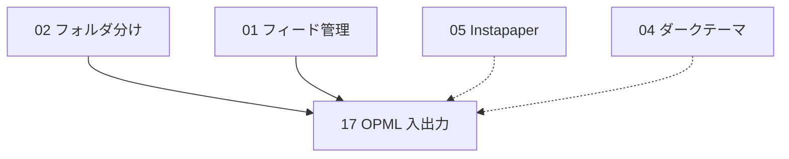

# 17 OPML 入出力（インポート / エクスポート）

> 読み手前提: このリポジトリのコードは持っているが、この設計会話の文脈は知らない別セッション（effort の低い実装者）。本書1ファイルだけで着手・完了できるよう、再利用資産・依存追加・関数シグネチャ・SQL（既存の再利用）・XML 仕様・ルート文字列・フロント変更・テストまで具体化する。
> **要確認**: OPML には方言（Google Reader 系のネスト、フラット構造、`type` 属性の有無など）がある。§11 に対応方針を記す。本書のパース方針は「`xmlUrl` を持つ `<outline>` をフィード、`xmlUrl` を持たず子 `<outline>` を持つ `<outline>` をフォルダ」とする最大公約数。

---

## 1. 概要

購読中フィードの一覧を **OPML 2.0**（RSS リーダー間でフィード集合を受け渡す業界標準 XML）で **インポート/エクスポート** できるようにする。他リーダー（Feedly / Inoreader / NetNewsWire 等）からの移行と、本リーダーからのバックアップ・移行を可能にする。

- **エクスポート** `GET /api/opml/export`: 現在の `feeds` + `folders` を OPML XML として返す。**フォルダ階層を保持**（フォルダ = 親 `<outline>`、その配下にフィード `<outline>` をネスト）。フォルダ未割当のフィードは body 直下に置く。`Content-Disposition: attachment` でブラウザにファイルダウンロードさせる。
- **インポート** `POST /api/opml/import`: OPML XML を受け取り、フォルダとフィードを作成する。**既存の `feeds` / `folders` リポジトリを再利用**し、新テーブルは作らない。フィードは `url` で、フォルダは `name` で **冪等にデデュープ**（再インポートしても重複しない）。

本機能はバックエンドに **新スライス `opml` を1枚**追加し、`features/mod.rs` に `.merge(opml::routes())` を1行足すだけで成立する（Vertical Slice 厳守）。既存スライス（`feeds` / `folders` / `articles`）は **一切編集しない**（リポジトリ関数を呼ぶだけ）。

> **AI 連携（`shared/llm`）について**: 本機能は要約/翻訳のような LLM 機能を **使わない**。したがって `shared/llm` の再利用も `ANTHROPIC_API_KEY` 由来の `AppError::NotEnabled` ゲートも **本スライスには登場しない**（OPML はネットワーク不要・DB のみで完結する純データ操作）。AI 機能を持つ将来スライスはこのゲートに従うこと、という土台規約の確認に留める。

---

## 2. スコープ / 非スコープ

### スコープ（本機能で実装する）
- 新スライス `backend/src/features/opml/`（`domain` / `repository` / `service` / `handler` / `mod`）。
- `GET /api/opml/export` — `feeds` + `folders` を OPML 2.0 XML で返す。フォルダ階層保持。フォルダ未割当フィードは body 直下。
- `POST /api/opml/import` — OPML XML を受け取りフォルダ/フィードを作成。`url` でフィード、`name` でフォルダを **冪等デデュープ**。結果サマリ JSON（`imported_feeds` / `imported_folders` / `skipped`）を返す。
- **純粋関数のパーサ/ジェネレータ**を `domain.rs` に置く（`parse_opml(&str) -> Result<Vec<ParsedGroup>, String>` / `build_opml(&[ExportGroup]) -> String` / `xml_escape(&str) -> String`）。外部 I/O を持たないので TDD で Red→Green を回せる。
- 依存追加 **`quick-xml`**（インポートのパースに使用。エクスポートは手書き文字列生成 + `xml_escape`）。§3 / §4 で正当化。
- フロント: `lib/api.ts` に型 `ImportOpmlResult` と `importOpml(xml)` メソッド + エクスポート用 URL 定数。`routes/Settings.tsx`（機能 05 が新設済みでなければ本機能で新設）に **OPML セクション（Card 1枚）**: エクスポートのダウンロードリンク + インポート用ファイル選択。
- バックエンドの純関数ユニットテスト（`#[cfg(test)] mod tests` を `domain.rs` に）＋ HTTP スモークテスト（`scripts/test/api-opml.sh`）。

### 非スコープ（本機能では実装しない）
- **新テーブル・新マイグレーション**（既存 `feeds` / `folders` を再利用するため不要。§4）。
- フィード本文の即時クロール。インポートしたフィードの記事取得は **既存スケジューラ（`shared/scheduler.rs` の定期 refresh）に委ねる**。任意で best-effort のバックグラウンド取得を spawn する代替を §11 に記す（同期 fetch はしない＝大量フィードで応答がブロックされるのを避ける）。
- OPML 内のフォルダの **3階層以上のネスト**の完全再現（本リーダーのデータモデルは「フォルダ1段 + フィード」のフラット2層。深いネストは**最も内側に近いフォルダ名へ畳む**。§5.1 / §11）。
- 記事・既読状態・要約/翻訳キャッシュの入出力（OPML はフィード購読リストの規格であり記事は含まない）。
- インポートの dry-run / プレビュー / 差分マージ UI（MVP は「作成 + デデュープ」のみ）。
- マルチユーザ・権限（単一ユーザ前提）。

---

## 3. 既存実装の再利用

実ファイルを確認済み。以下を **再利用し、車輪の再発明をしない**。

| 再利用資産 | 実体（確認済みファイル） | 本機能での使い方 |
|---|---|---|
| フィード作成（URL 検証 + upsert デデュープ） | `feeds/domain.rs::FeedUrl::parse`（`http(s)` 検査 + trim）、`feeds/repository.rs::insert`（`INSERT ... ON CONFLICT (url) DO UPDATE ... RETURNING`） | インポートの各 `xmlUrl` を `FeedUrl::parse` で検証 → `feeds::repository::insert` で作成（既存 URL はデデュープされ既存 `Feed` が返る） |
| フィード一覧 | `feeds/repository.rs::list_all`（`ORDER BY created_at DESC`） | エクスポート時に全フィードを引く |
| フィードのフォルダ割当（部分更新） | `feeds/repository.rs::update`（`folder_id: Option<Option<FolderId>>` の三値更新）、`feeds/service.rs::update_feed`（フォルダ存在チェック付き） | インポートでフィードをフォルダに割り当てる（`update(pool, feed.id, None, Some(Some(folder_id)))`） |
| フォルダ作成 / 一覧 | `folders/repository.rs::insert`（`position` を `MAX+1` 採番）、`folders/repository.rs::list_all`（`ORDER BY position, created_at`） | インポートでフォルダ作成、エクスポートでフォルダ階層を出力 |
| フォルダ名検証 | `folders/domain.rs::FolderName::parse`（trim・空・100字上限） | インポートの `text`/`title` 属性をフォルダ名として検証。長すぎ/空はスキップ（§5.3） |
| 主キー newtype | `feeds/domain.rs::FeedId`、`folders/domain.rs::FolderId`（`#[sqlx(transparent)]`） | フォルダ割当時に `FolderId` を渡す。`FeedId(uuid)` で構築 |
| `AppState { db, config, http }` | `backend/src/shared/state.rs`（`#[derive(Clone)]`） | サービスは `&AppState` を取り `state.db` を使う。OPML はネットワーク不要なので `state.http` は使わない |
| `AppError` 6 バリアント | `backend/src/shared/error.rs`（`NotFound`/404, `Validation(String)`/400, `NotEnabled`/503, `Upstream`/502, `Database(#[from] sqlx::Error)`/500, `Other(#[from] anyhow::Error)`/500。`IntoResponse` で `Json({"error": <Display>})`） | パース失敗 = `Validation`。DB エラーは `?` で自動 `From`。**`error.rs` は編集しない**・新バリアントは足さない |
| スライス構成 + `routes()` | `feeds/mod.rs`・`folders/mod.rs`（`domain/repository/service/handler/mod`、`fn routes() -> Router<AppState>`） | 同じ5ファイル構成で `opml` を作る |
| `features/mod.rs` の合成 | `pub mod ...;` + `.merge(...::routes())`（既存8スライスを `router()` で merge） | `pub mod opml;` と `.merge(opml::routes())` を1行ずつ追加。既存スライスは触らない |
| sqlx ランタイムクエリ | 全スライスが `query`/`query_as`（`query!` マクロ禁止） | 本スライスは原則 **既存リポジトリ関数を呼ぶだけ**。独自 SQL は §5.2 の読み取り射影のみ |
| フロント API クライアント | `frontend/src/lib/api.ts`（`http<T>()` は 204→`undefined` 畳み込み、`headers` を `init` で上書き可能） | `importOpml` で `Content-Type: application/xml` を上書きして XML 本文を送る |
| 自前 UI 部品 | `frontend/src/components/ui/{button,card,input}.tsx` | `Settings.tsx` の OPML Card で `Card` / `Button` を使う。ファイル入力は素の `<input type="file">` |
| HTTP スモークテストの慣習 | `scripts/test/api-*.sh`（稼働スタックへ curl、HTTP コード + JSON キーを assert） | `scripts/test/api-opml.sh` を同型で新設（§9.3） |
| 自動マイグレーション実行 | `main.rs` 起動時 `sqlx::migrate!("./migrations").run()` | **本機能は新マイグレーション無し**（§4）。配線追加も不要 |

---

## 4. データモデルとマイグレーション

### 4.1 新テーブル・新マイグレーションは不要

本機能は **既存テーブル `feeds` / `folders` を読み書きするだけ**で、独自の永続状態を持たない。したがって **新規マイグレーションは追加しない**。

参考までに現状のスキーマ（再掲・本機能が依存する列のみ）:

```text
feeds   (id UUID PK, url TEXT UNIQUE, title TEXT NULL, folder_id UUID NULL → folders.id,
         created_at TIMESTAMPTZ, last_fetched_at TIMESTAMPTZ NULL)
folders (id UUID PK, name TEXT NOT NULL, position INT NOT NULL, created_at TIMESTAMPTZ)
```

- インポートは `folders` に行を追加（既存名は再利用）、`feeds` に行を追加（既存 URL は `ON CONFLICT` でデデュープ）し、`feeds.folder_id` を更新する。
- エクスポートは両テーブルを `SELECT` するのみ。

### 4.2 もし将来カラム追加が必要になった場合の番号採番（注記）

本機能では不要だが、土台規約として記す: マイグレーションは **追記のみ**（既存ファイルは編集しない）。**現状の最新は `0005_search.sql`**。新規が要るなら `0006_*.sql` 以降を取るが、**着手前に必ず `ls backend/migrations/` で最新番号を確認**し、その時点の最小空き整数を採ること（apalis 移行など並行タスクが先に番号を消費している可能性がある。`main.rs` の migrator は out-of-order を許容しないため）。

### 4.3 依存追加: `quick-xml`

インポートの XML パースに **`quick-xml`** を追加する。`backend/Cargo.toml` の `[dependencies]` に1行:

```toml
quick-xml = "0.36"
```

正当化:
- OPML は任意の他リーダーが吐いた XML を受け付ける必要があり、**手書きパースは堅牢性に欠ける**（エスケープ・属性順・名前空間・自己終了タグ・コメント）。`quick-xml` は依存が軽量（`serde` 不要・pull パーサ）で feed-rs エコシステムでも一般的。
- **エクスポートは新依存を増やさず手書き文字列生成 + `xml_escape`**（§5.1）。出力は本リーダーが構造を完全に制御するため、属性値のエスケープさえすれば安全かつ決定的で、ユニットテストも書きやすい。よって `quick-xml` の `Writer` は使わない。
- バージョンは着手時に最新安定版を確認（`0.36` 系を想定。API は `quick-xml::Reader` / `events::Event` / `BytesStart::attributes()`）。

---

## 5. バックエンド設計

新スライス **`backend/src/features/opml/`**。5ファイル構成。

### 5.1 `domain.rs`（値オブジェクト + 純粋なパース/生成ロジック）

```rust
use serde::Serialize;

// ---- インポート（パース）side ----

/// OPML から読み取ったフィード1件（DB 反映前の中間表現）。
#[derive(Debug, Clone, PartialEq, Eq)]
pub struct ParsedFeed {
    pub title: Option<String>, // text/title 属性。無ければ None（後段で URL を仮タイトルにしない＝フィード自身のタイトルは crawl で付く）
    pub xml_url: String,       // xmlUrl 属性（必須。無いものはフィードとみなさない）
}

/// OPML から読み取ったグループ。folder=None は「フォルダ未割当（body 直下）」。
#[derive(Debug, Clone, PartialEq, Eq)]
pub struct ParsedGroup {
    pub folder: Option<String>, // フォルダ名。None=未割当
    pub feeds: Vec<ParsedFeed>,
}

/// OPML XML 文字列を ParsedGroup のリストへ変換する純粋関数（I/O 無し＝テスト容易）。
/// 規則:
///  - `xmlUrl` を持つ `<outline>` = フィード。直近の祖先フォルダに属する。
///  - `xmlUrl` を持たず子 `<outline>` を持つ（または type が無くテキストのみの）`<outline>` = フォルダ。
///  - フォルダのネストが2段以上深い場合は「フィードの直近祖先フォルダ名」だけを採用（フラット2層へ畳む）。
///  - タイトルは title 属性 → 無ければ text 属性 → 無ければ None。
///  - 不正 XML は Err(String)（呼び出し側で AppError::Validation に整形）。
pub fn parse_opml(xml: &str) -> Result<Vec<ParsedGroup>, String> {
    // 実装方針（quick-xml の pull パース）:
    //  - Reader::from_str(xml) で Event を回す。
    //  - <outline> の開始時に xmlUrl 属性を見る:
    //      * あれば ParsedFeed を「現在のフォルダ」グループに push。
    //      * なければ「フォルダ開始」とみなし、現在フォルダ名をスタックに積む（最内を採用）。
    //  - </outline> でフォルダをスタックから戻す。
    //  - 自己終了 <outline ... /> (Event::Empty) もフィード/空フォルダとして処理。
    //  - 結果は「フォルダ名 -> feeds」を挿入順で保持（folder=None を先頭または末尾に1グループ）。
    //  - quick-xml の Error は map_err で String 化して返す。
    todo!("§9.1 のテストを Green にする実装")
}

// ---- エクスポート（生成）side ----

/// エクスポート対象フィード1件。
#[derive(Debug, Clone)]
pub struct ExportFeed {
    pub title: Option<String>,
    pub xml_url: String,
    pub html_url: Option<String>, // 任意。本リーダーは保持しないので基本 None
}

/// エクスポートのグループ。folder=None は body 直下（未割当）。
#[derive(Debug, Clone)]
pub struct ExportGroup {
    pub folder: Option<String>,
    pub feeds: Vec<ExportFeed>,
}

/// ExportGroup 群を OPML 2.0 XML 文字列へ生成する純粋関数。
/// folder=Some(name) はネストした親 <outline> として、folder=None は body 直下に出力。
pub fn build_opml(groups: &[ExportGroup]) -> String {
    let mut out = String::new();
    out.push_str("<?xml version=\"1.0\" encoding=\"UTF-8\"?>\n");
    out.push_str("<opml version=\"2.0\">\n");
    out.push_str("  <head>\n    <title>RSS Reader Subscriptions</title>\n  </head>\n");
    out.push_str("  <body>\n");
    for g in groups {
        match &g.folder {
            Some(name) => {
                let n = xml_escape(name);
                out.push_str(&format!(
                    "    <outline text=\"{n}\" title=\"{n}\">\n"
                ));
                for f in &g.feeds {
                    out.push_str(&feed_outline(f, "      "));
                }
                out.push_str("    </outline>\n");
            }
            None => {
                for f in &g.feeds {
                    out.push_str(&feed_outline(f, "    "));
                }
            }
        }
    }
    out.push_str("  </body>\n</opml>\n");
    out
}

fn feed_outline(f: &ExportFeed, indent: &str) -> String {
    let title = xml_escape(f.title.as_deref().unwrap_or(""));
    let xml_url = xml_escape(&f.xml_url);
    let html = f
        .html_url
        .as_deref()
        .map(|h| format!(" htmlUrl=\"{}\"", xml_escape(h)))
        .unwrap_or_default();
    format!(
        "{indent}<outline type=\"rss\" text=\"{title}\" title=\"{title}\" xmlUrl=\"{xml_url}\"{html}/>\n"
    )
}

/// XML 属性値のエスケープ（純粋関数 = 単体テスト対象）。
pub fn xml_escape(s: &str) -> String {
    s.replace('&', "&amp;")
        .replace('<', "&lt;")
        .replace('>', "&gt;")
        .replace('"', "&quot;")
        .replace('\'', "&apos;")
}

/// インポート結果サマリ（handler が JSON で返す）。
#[derive(Debug, Clone, Serialize, PartialEq, Eq)]
pub struct ImportSummary {
    pub imported_feeds: usize,   // 新規作成 or デデュープ含め「取り込んだ」フィード数
    pub imported_folders: usize, // 新規作成したフォルダ数
    pub skipped: usize,          // 不正 URL / 不正フォルダ名でスキップした数
}
```

> **`&` を最初に置換**するのは二重エスケープ防止の定石（後段の `&lt;` 等の `&` を再変換しないため）。
> パース本体は `todo!()` ではなく §9.1 のテストを通す実装を書く。`quick-xml` の具体 API（`Reader`, `Event::Start/Empty/End`, `attr.key.as_ref()`, `attr.unescape_value()`）は着手時に [docs.rs/quick-xml](https://docs.rs/quick-xml) で確認すること（§11）。

### 5.2 `repository.rs`（読み取り射影のみ自前。書き込みは既存リポジトリへ委譲）

本スライスは原則 **既存の `feeds` / `folders` リポジトリ関数を呼ぶ**（§3）。独自に持つのは「フォルダを名前で引く」読み取りヘルパだけ（既存 `folders` リポジトリに get-by-name が無く、インポートのフォルダ冪等化に必要なため）。

```rust
use sqlx::PgPool;

use crate::features::folders::domain::FolderId;
use crate::shared::error::AppResult;

/// 既存フォルダを「名前 -> id」で引くための読み取り射影。
/// folders::repository::list_all でも代替できるが、インポートのデデュープ用に
/// 軽量な (id, name) だけを取る読み取り専用クエリを本スライス内に閉じて持つ。
#[derive(Debug, Clone, sqlx::FromRow)]
pub struct FolderNameRow {
    pub id: FolderId,
    pub name: String,
}

pub async fn list_folder_names(pool: &PgPool) -> AppResult<Vec<FolderNameRow>> {
    let rows = sqlx::query_as::<_, FolderNameRow>(
        "SELECT id, name FROM folders ORDER BY position, created_at",
    )
    .fetch_all(pool)
    .await?;
    Ok(rows)
}
```

> 書き込み（フォルダ作成・フィード作成・フォルダ割当）は **新 SQL を書かず**、`folders::repository::insert` / `feeds::repository::insert` / `feeds::repository::update` を呼ぶ（§5.3）。これにより `position` 採番や `ON CONFLICT (url)` デデュープなど既存の不変条件をそのまま享受でき、`feeds`/`folders` の書き込み所有を越境しない（読み取りのクロステーブル参照は既存コードベースの前例どおり許容。`feeds/repository.rs` が `folders::domain::FolderId` を import している）。`query!` マクロは使わない。

### 5.3 `service.rs`（`&AppState` を取りパース結果を既存リポジトリへ反映）

```rust
use std::collections::HashMap;

use super::domain::{
    build_opml, parse_opml, ExportFeed, ExportGroup, ImportSummary,
};
use super::repository;
use crate::features::feeds;
use crate::features::folders;
use crate::features::folders::domain::{FolderId, FolderName};
use crate::features::feeds::domain::{FeedId, FeedUrl};
use crate::shared::error::{AppError, AppResult};
use crate::shared::state::AppState;

/// OPML XML をインポートし、フォルダ/フィードを作成（冪等）。
pub async fn import_opml(state: &AppState, xml: &str) -> AppResult<ImportSummary> {
    let groups = parse_opml(xml).map_err(AppError::Validation)?;

    // 既存フォルダ名 -> id のマップを1回だけ読む（冪等デデュープの基準）。
    let mut folder_map: HashMap<String, FolderId> = repository::list_folder_names(&state.db)
        .await?
        .into_iter()
        .map(|r| (r.name, r.id))
        .collect();

    let mut imported_feeds = 0usize;
    let mut imported_folders = 0usize;
    let mut skipped = 0usize;

    for group in groups {
        // フォルダ解決（None=未割当）。
        let folder_id: Option<FolderId> = match group.folder {
            None => None,
            Some(raw_name) => {
                // フォルダ名を検証。空/長すぎはこのグループのフィードを未割当扱いにする。
                match FolderName::parse(&raw_name) {
                    Ok(valid) => {
                        let key = valid.as_str().to_string();
                        if let Some(id) = folder_map.get(&key) {
                            Some(*id) // 既存フォルダを再利用（冪等）
                        } else {
                            let folder = folders::repository::insert(&state.db, &key).await?;
                            imported_folders += 1;
                            folder_map.insert(key, folder.id);
                            Some(folder.id)
                        }
                    }
                    Err(_) => None, // 不正フォルダ名 → 未割当に降格（フィード自体は取り込む）
                }
            }
        };

        for pf in group.feeds {
            // URL を検証。不正なら skip。
            let url = match FeedUrl::parse(&pf.xml_url) {
                Ok(u) => u,
                Err(_) => {
                    skipped += 1;
                    continue;
                }
            };
            // 既存 URL は ON CONFLICT でデデュープされ、既存 Feed が返る。
            let feed = feeds::repository::insert(&state.db, url.as_str()).await?;
            imported_feeds += 1;

            // フォルダ割当（指定があるときだけ。None は据え置きにせず明示的に「未割当のまま」）。
            if let Some(fid) = folder_id {
                // update の folder_id 三値: Some(Some(x)) = 割当。title は None=据え置き。
                feeds::repository::update(
                    &state.db,
                    FeedId(feed.id.0),
                    None,
                    Some(Some(fid)),
                )
                .await?;
            }
        }
    }

    Ok(ImportSummary {
        imported_feeds,
        imported_folders,
        skipped,
    })
}

/// 現在の feeds + folders を OPML XML 文字列として生成。
pub async fn export_opml(state: &AppState) -> AppResult<String> {
    let folders = folders::repository::list_all(&state.db).await?; // position, created_at 順
    let feeds = feeds::repository::list_all(&state.db).await?; // created_at DESC

    // folder_id -> feeds に振り分け。
    let mut by_folder: HashMap<Option<FolderId>, Vec<ExportFeed>> = HashMap::new();
    for f in feeds {
        let ef = ExportFeed {
            title: f.title.clone(),
            xml_url: f.url.clone(),
            html_url: None, // 本リーダーは htmlUrl を保持しない
        };
        by_folder.entry(f.folder_id).or_default().push(ef);
    }

    let mut groups: Vec<ExportGroup> = Vec::new();
    // 1) フォルダ未割当（body 直下）を先頭に。
    if let Some(unfiled) = by_folder.remove(&None) {
        if !unfiled.is_empty() {
            groups.push(ExportGroup { folder: None, feeds: unfiled });
        }
    }
    // 2) フォルダを position 順に。空フォルダも階層保持のため出力する。
    for folder in folders {
        let feeds = by_folder.remove(&Some(folder.id)).unwrap_or_default();
        groups.push(ExportGroup {
            folder: Some(folder.name),
            feeds,
        });
    }

    Ok(build_opml(&groups))
}
```

> **trait/dyn を足さない**: OPML パース/生成は `domain.rs` の純関数で、差し替え予定が無いので抽象境界（`shared/llm` 以外）は作らない方針に沿う。
> **dead_code 注意**: 本クレートは binary crate（`lib.rs` 無し）。`import_opml`/`export_opml`/`list_folder_names` はすべて handler から呼ばれるため `-D warnings` でも未使用警告は出ない。

### 5.4 `handler.rs`（axum ハンドラ）

```rust
use axum::body::Bytes;
use axum::extract::State;
use axum::http::{header, HeaderMap, HeaderValue};
use axum::Json;

use super::domain::ImportSummary;
use super::service;
use crate::shared::error::{AppError, AppResult};
use crate::shared::state::AppState;

/// POST /api/opml/import — 本文は OPML XML（Content-Type は問わない。Bytes で受け UTF-8 検証）。
pub async fn import(
    State(state): State<AppState>,
    body: Bytes,
) -> AppResult<Json<ImportSummary>> {
    let xml = std::str::from_utf8(&body)
        .map_err(|_| AppError::Validation("OPML body must be valid UTF-8".into()))?;
    if xml.trim().is_empty() {
        return Err(AppError::Validation("OPML body is empty".into()));
    }
    let summary = service::import_opml(&state, xml).await?;
    Ok(Json(summary))
}

/// GET /api/opml/export — OPML XML をダウンロードさせる。
pub async fn export(State(state): State<AppState>) -> AppResult<(HeaderMap, String)> {
    let xml = service::export_opml(&state).await?;
    let mut headers = HeaderMap::new();
    headers.insert(
        header::CONTENT_TYPE,
        HeaderValue::from_static("text/x-opml; charset=utf-8"),
    );
    headers.insert(
        header::CONTENT_DISPOSITION,
        HeaderValue::from_static("attachment; filename=\"feeds.opml\""),
    );
    Ok((headers, xml))
}
```

> `Bytes` 抽出は Content-Type を要求しない（`String` 抽出は環境により `text/*` を要求しうる）。ブラウザの `<input type="file">` 経由・`fetch` 経由のいずれでも確実に受けるため `Bytes` + UTF-8 検証にする。
> axum 既定のボディサイズ上限（2MiB）で通常の購読 OPML は十分。巨大ファイルを許すなら `DefaultBodyLimit` を本ルートに付与する（§11）。

### 5.5 `mod.rs`（routes）

```rust
pub mod domain;
pub mod handler;
pub mod repository;
pub mod service;

use axum::routing::{get, post};
use axum::Router;

use crate::shared::state::AppState;

pub fn routes() -> Router<AppState> {
    Router::new()
        .route("/api/opml/export", get(handler::export))
        .route("/api/opml/import", post(handler::import))
}
```

### 5.6 `features/mod.rs` への追加（2行のみ）

```rust
pub mod opml; // 既存 pub mod 群（articles..stats）の並びに追加

// router() 内の .merge チェーンに1行追加:
        .merge(opml::routes())
```

既存スライス（articles/feeds/folders/feed_overview/instapaper/search/stats/health）は一切触らない。

### 5.7 AppError の使い分け（`error.rs` は不編集）

| 状況 | バリアント | HTTP | レスポンス `error`（Display） |
|---|---|---|---|
| 本文が空 / 非 UTF-8 | `Validation` | 400 | `invalid input: OPML body is empty` 等 |
| XML パース失敗（不正 OPML） | `Validation` | 400 | `invalid input: <quick-xml のエラー文>` |
| 個々の不正 `xmlUrl` / 不正フォルダ名 | （エラーにしない） | — | `skipped` カウントに加算 or フォルダ未割当に降格（部分成功を許容） |
| DB エラー | `Database`（`?` で自動 `From`） | 500 | `internal error` |

> **部分成功の方針**: OPML 全体が壊れている（XML として無効）なら 400。個々のフィード/フォルダの不備（不正 URL・空フォルダ名）は **全体を失敗させず**スキップ/降格してサマリに反映する。移行用途では「100 件中 2 件だけ不正」でも残り 98 件を取り込めることが価値になるため。新バリアントは追加しない。

---

## 6. フロントエンド設計

### 6.1 `lib/api.ts` への追加（型1 + メソッド1 + 定数1）

型（backend JSON をミラー）:

```ts
export interface ImportOpmlResult {
  imported_feeds: number;
  imported_folders: number;
  skipped: number;
}
```

`api` オブジェクトにメソッド追加（既存 `http<T>()` を再利用。`headers` を上書きして XML を送る）:

```ts
  importOpml: (xml: string) =>
    http<ImportOpmlResult>("/api/opml/import", {
      method: "POST",
      headers: { "Content-Type": "application/xml" }, // 既定の application/json を上書き
      body: xml,
    }),
```

エクスポートは **ファイルダウンロード**なので `http<T>()`（JSON 前提）を通さず、アンカーで直接開く。定数を1つ公開:

```ts
export const OPML_EXPORT_URL = "/api/opml/export";
```

> `http<T>()` は `headers: {...}, ...init` の順なので、`init.headers` を渡すと **ヘッダ全体が置き換わる**。`importOpml` は `Content-Type: application/xml` のみ指定すれば良い（バックエンドは Content-Type を見ず Bytes で受けるため、厳密には何でも可）。

### 6.2 `routes/Settings.tsx` に OPML セクション（Card 1枚）

機能 05（Instapaper）が `Settings.tsx` を新設済みならそこに **Card を1枚追記**、未新設なら本機能で `Settings.tsx` を新規作成し OPML Card を置く（先着が骨格を作り、後着は Card を足すだけ。05 設計書 §6.3 と同じ共存ルール）。

UI 骨子（状態はローカル `createSignal`、グローバルストアは結果反映のみ使う）:

- **エクスポート**: `<a href={OPML_EXPORT_URL} download="feeds.opml">` を `Button` 風に装飾（`<Button as="a" ...>` か、アンカーに `class` でボタン見た目）。クリックでブラウザがダウンロード。
- **インポート**: `<input type="file" accept=".opml,.xml,text/xml,application/xml">`。`onChange` で `file.text()` を読み、`await api.importOpml(text)` を呼ぶ。
  - 成功: `ImportOpmlResult` を「フィード N 件 / フォルダ M 件 / スキップ K 件」と表示し、**`store.refetchFeeds()` と `store.refetchFolders()`** を呼んで左ペインを更新。
  - 失敗（400 = 不正 OPML 等）: `errorStatus(e)` で分岐し `error` シグナルにメッセージ表示。
  - 処理中は `busy` シグナルで input/ボタンを無効化。
- 装飾は `card.tsx`。ラベル `text-sm font-medium`、説明 `text-xs text-muted-foreground`。

実装スケッチ:

```tsx
import { createSignal } from "solid-js";
import { api, OPML_EXPORT_URL, errorStatus } from "@/lib/api";
import { useApp } from "@/lib/store";
import { Card } from "@/components/ui/card";
import { Button } from "@/components/ui/button";

export function OpmlCard() {
  const store = useApp();
  const [busy, setBusy] = createSignal(false);
  const [msg, setMsg] = createSignal<string | null>(null);
  const [error, setError] = createSignal<string | null>(null);

  async function onFile(e: Event & { currentTarget: HTMLInputElement }) {
    const file = e.currentTarget.files?.[0];
    if (!file) return;
    setBusy(true);
    setError(null);
    setMsg(null);
    try {
      const xml = await file.text();
      const r = await api.importOpml(xml);
      setMsg(`フィード ${r.imported_feeds} 件 / フォルダ ${r.imported_folders} 件 / スキップ ${r.skipped} 件`);
      store.refetchFeeds();
      store.refetchFolders();
    } catch (err) {
      const code = errorStatus(err);
      setError(code === 400 ? "OPML を解析できませんでした" : "インポートに失敗しました");
    } finally {
      setBusy(false);
      e.currentTarget.value = ""; // 同じファイルを再選択できるようにクリア
    }
  }

  return (
    <Card class="p-4 space-y-3">
      <div>
        <h3 class="text-sm font-medium">OPML 入出力</h3>
        <p class="text-xs text-muted-foreground">
          他のリーダーからフィードを取り込んだり、購読をバックアップできます。
        </p>
      </div>
      <a
        href={OPML_EXPORT_URL}
        download="feeds.opml"
        class="inline-flex h-9 items-center rounded-md border border-input px-3 text-sm hover:bg-accent"
      >
        OPML をエクスポート
      </a>
      <div>
        <label class="text-sm font-medium">OPML をインポート</label>
        <input
          type="file"
          accept=".opml,.xml,text/xml,application/xml"
          disabled={busy()}
          onChange={onFile}
          class="mt-1 block w-full text-sm"
        />
      </div>
      {msg() && <p class="text-xs text-muted-foreground">{msg()}</p>}
      {error() && <p class="text-xs text-destructive">{error()}</p>}
    </Card>
  );
}
```

> `store.refetchFeeds()` / `store.refetchFolders()` は `lib/store.tsx`（CHEATSHEET の `UiStore`）に既存。インポート後に左ペインのフィード/フォルダ一覧を更新するために呼ぶ。**store への新フィールド追加は不要**。

### 6.3 ルーティング `index.tsx`

`/settings` ルートが未登録なら追加（05 が追加済みなら不要）:

```tsx
import Settings from "./routes/Settings";
// ...
<Route path="/settings" component={Settings} />
```

`Settings.tsx` 本体は `<OpmlCard />`（＋ 05 の Instapaper Card 等）を縦に並べるだけ。設定画面への導線（サイドバー/ヘッダのリンク）は二ペイン（機能 10）が整備する。本機能では `/settings` を直接開けば使える状態で足りる。

### 6.4 Ark UI について

本機能の UI は file input / アンカー / card のみで、いずれも自前 Tailwind で賄える。**Ark UI 部品は不要**。

---

## 7. API 契約

> すべて `/api` プレフィックス。

### 7.1 `GET /api/opml/export` — 購読を OPML で出力

リクエスト: ボディ無し。

レスポンス（200）:
- ヘッダ: `Content-Type: text/x-opml; charset=utf-8`、`Content-Disposition: attachment; filename="feeds.opml"`
- ボディ（例。フォルダ "Tech" に1件、未割当1件）:

```xml
<?xml version="1.0" encoding="UTF-8"?>
<opml version="2.0">
  <head>
    <title>RSS Reader Subscriptions</title>
  </head>
  <body>
    <outline type="rss" text="Hacker News" title="Hacker News" xmlUrl="https://news.ycombinator.com/rss"/>
    <outline text="Tech" title="Tech">
      <outline type="rss" text="Rust Blog" title="Rust Blog" xmlUrl="https://blog.rust-lang.org/feed.xml"/>
    </outline>
  </body>
</opml>
```

### 7.2 `POST /api/opml/import` — OPML を取り込み

リクエスト:
- ヘッダ: `Content-Type: application/xml`（任意。サーバは Content-Type を見ず本文を UTF-8 として読む）
- ボディ: OPML XML（§7.1 と同形式）

レスポンス（200）:

```json
{ "imported_feeds": 2, "imported_folders": 1, "skipped": 0 }
```

エラー:
- 400 `{ "error": "invalid input: OPML body is empty" }`（空ボディ）
- 400 `{ "error": "invalid input: <パースエラー>" }`（XML として不正）
- 500 `{ "error": "internal error" }`（DB エラー）

セマンティクス:
- フィードは `xmlUrl` で冪等デデュープ（既存 URL は重複作成されず `imported_feeds` にはカウントされる＝「取り込み対象として処理した数」）。
- フォルダは `name` で冪等デデュープ。新規作成したフォルダのみ `imported_folders` にカウント。
- 個々の不正 `xmlUrl` は `skipped` に加算（全体は失敗させない）。不正/空フォルダ名は当該フィードを未割当に降格。

---

## 8. 依存関係

- **本機能が依存する機能 / 既存資産**:
  - 機能 02（フォルダ分け）の `folders` テーブル・`folders` スライス（`insert`/`list_all` を呼ぶ）。**02 がマージ済みであること**（`0002_folders.sql` と `folders` スライスが必要）。現状リポジトリには `folders` スライスが存在するため前提は満たされている。
  - 機能 01 系の `feeds::repository::update`（部分更新）。現状 `feeds/repository.rs` に存在。
  - ソフト: 機能 05（Instapaper）/ 04（ダークテーマ）と `/settings` ルート・`Settings.tsx` を共有（Card 単位で非干渉に共存。先着が `Settings.tsx` を作る）。
- **本機能をブロックする機能（本機能に依存する）**: 無し（OPML は末端機能）。
- 既存スライスへのコード変更は無し。`features/mod.rs` への2行追加と `Cargo.toml` への `quick-xml` 1行追加のみが既存ファイルへの接触点（フロントは `lib/api.ts` 追記 + `Settings.tsx`/`index.tsx`）。

依存グラフ（抜粋）:



---

## 9. テスト計画（TDD）

> 方針: パース/生成は純関数なので **`domain.rs` の `#[cfg(test)] mod tests` でユニットテストを厚く**（外部 I/O 不要・Red→Green が速い）。DB を絡めるインポートの冪等性は HTTP スモークで担保（binary crate のため `backend/tests/` から内部関数を直接呼べない事情は 05 設計書 §9 と同じ）。

### 9.1 ユニットテスト（`#[cfg(test)] mod tests` in `domain.rs`、I/O 不要）

`backend/src/features/opml/domain.rs` 末尾に追加。Red を先に書く。

| テスト | 意図 |
|---|---|
| `parse_single_feed_no_folder` | `xmlUrl` 付き `<outline>` 1件・フォルダ無し → `folder=None` の1グループ・feed 1件 |
| `parse_feed_inside_folder` | フォルダ `<outline>` 配下にフィード → `folder=Some("Tech")`・feed 1件 |
| `parse_multiple_feeds_in_one_folder` | 1フォルダに複数フィード → 同一グループに複数 feed |
| `parse_self_closing_outline` | 自己終了 `<outline ... />`（`Event::Empty`）もフィードとして拾う |
| `parse_title_falls_back_to_text_attr` | `title` 欠落時に `text` 属性をタイトルにする |
| `parse_title_none_when_both_absent` | `title`/`text` 両方無し → `ParsedFeed.title = None` |
| `parse_skips_outline_without_xmlurl_as_folder` | `xmlUrl` 無し + 子あり → フォルダ扱い（feed にしない） |
| `parse_deep_nesting_flattens_to_innermost_folder` | 2段以上ネスト → フィードは直近祖先フォルダ名に属する |
| `parse_unescapes_entities` | `&amp;` を含む属性 → `&` に復元される（quick-xml の unescape） |
| `parse_rejects_malformed_xml` | 閉じタグ不整合などで `Err` |
| `build_opml_empty_groups_is_valid_skeleton` | 空入力 → `<opml>...<body></body></opml>` の妥当な骨格 |
| `build_opml_top_level_feed` | `folder=None` の feed → body 直下の `<outline type="rss" .../>` |
| `build_opml_folder_with_feeds_nested` | `folder=Some` → 親 `<outline>` 配下にネスト |
| `build_opml_escapes_attributes` | `&`/`<`/`"` を含むタイトル/URL がエスケープされる |
| `xml_escape_handles_all_five_entities` | `& < > " '` → `&amp; &lt; &gt; &quot; &apos;`（`&` 最優先で二重エスケープしない） |
| `round_trip_build_then_parse_preserves_structure` | `build_opml` の出力を `parse_opml` で読むとフォルダ/URL 構造が一致 |

### 9.2 サービスの冪等性（HTTP スモークで担保）

binary crate のため `import_opml`（`&AppState` 依存）を別クレートから直接テストできない。冪等性は §9.3 の HTTP スモークで「同じ OPML を2回 POST しても重複が増えない」を assert する。

### 9.3 HTTP スモークテスト（稼働スタックへの shell スクリプト）

`scripts/test/api-opml.sh` を新設（`scripts/test/api-stats.sh` と同型。nginx 経由のポートは既存スクリプトに合わせる）。

| 手順 / アサーション | 意図 |
|---|---|
| `GET /api/opml/export` → 200、`Content-Type` に `opml`、本文に `<opml` を含む | スライス合成 + エクスポート配線 |
| 小さな OPML（1フォルダ + 1フィード）を `POST /api/opml/import` → 200、JSON `imported_feeds>=1` | インポート配線 + サマリ |
| **同じ OPML をもう一度** `POST` → 200。直後に `GET /api/feeds` の件数が**増えていない**（URL デデュープ）/ `GET /api/folders` のフォルダ名が重複していない | 冪等性（フィード `ON CONFLICT`・フォルダ名再利用） |
| 不正 XML（`<opml><body><outline`）を `POST` → 400 | パース失敗の `Validation` |
| 空ボディを `POST` → 400 | 空入力ガード |

> import で作成したテスト用フィードの後始末（`DELETE /api/feeds/{id}`）をスクリプト末尾で行い、繰り返し実行を決定的にする。テスト用 URL は実在しなくてよい（OPML は購読リストであり crawl は別経路）。

### 9.4 フロント（手動 + 型）
- `tsc` 型チェック（`just lint`）で `api.ts` / `Settings.tsx`（`OpmlCard`）の型整合を確認。
- 手動: `/settings` で「エクスポート」→ `feeds.opml` がダウンロードされ中身が妥当 / 別リーダーの OPML を「インポート」→ 左ペインにフィード/フォルダが増える / 同じファイル再インポートで重複しない / 壊れた XML でエラー表示。

---

## 10. 実装手順（順序付きチェックリスト）

1. **依存追加**: `backend/Cargo.toml` の `[dependencies]` に `quick-xml = "0.36"`（着手時に最新安定版を確認）。`cargo build` で取得。
2. **ドメイン（Red 先行）**: `backend/src/features/opml/domain.rs` を作り、§5.1 の型・`build_opml`・`xml_escape`・`ImportSummary` を実装、`parse_opml` は最初 `todo!()` で型だけ通す。§9.1 のテストを先に書く（落ちる＝Red を確認）。
3. **パーサ実装で Green**: `parse_opml` を `quick-xml::Reader` で実装し §9.1 を全部通す。`quick-xml` の `Event::Start/Empty/End`・属性取得・`unescape_value` の API は docs.rs で確認。`cargo test`（DB 不要）で実行。
4. **repository**: `repository.rs` を §5.2 で作成（`list_folder_names` のみ自前 SQL。`query_as`、`query!` 不可）。
5. **service**: `service.rs` を §5.3 で作成。`feeds`/`folders` の既存リポジトリ関数を呼ぶ。インポートは「フォルダ解決（名前デデュープ）→ フィード insert（URL デデュープ）→ フォルダ割当 update」。
6. **handler**: `handler.rs` を §5.4 で作成。import は `Bytes` + UTF-8 検証、export は `(HeaderMap, String)`。
7. **mod + 合成**: `mod.rs` を §5.5 で作成。`features/mod.rs` に `pub mod opml;` と `.merge(opml::routes())` を追加（§5.6）。
8. **ビルド & lint**: `just lint`（clippy `-D warnings` / tsc）を通す。
9. **DB 起動 & スモーク**: `just dev-db` →（バックエンド起動）。`scripts/test/api-opml.sh` を §9.3 で作成・`chmod +x`・実行（export 200 / import サマリ / 冪等 / 400 ×2）。
10. **フロント**: `frontend/src/lib/api.ts` に `ImportOpmlResult`・`importOpml`・`OPML_EXPORT_URL`（§6.1）。`routes/Settings.tsx` に `OpmlCard`（§6.2）。`/settings` ルート未登録なら `index.tsx` に追加（§6.3）。`just lint` の tsc を通す。
11. **手動 E2E**: 他リーダーの実 OPML をインポート → 左ペインにフォルダ/フィード反映 → 再インポートで重複なし → エクスポートしてラウンドトリップ確認。
12. **コミット**: スライス・`Cargo.toml`・スクリプト・フロントをまとめて。秘密情報/`.env` はコミットしない。

---

## 11. リスク・未決事項・代替案

- **【要確認】`quick-xml` の API バージョン差**: `Reader`/`Event`/`attributes()`/`unescape_value()` のシグネチャはマイナーで変わりうる。着手時に docs.rs/quick-xml で `0.36`（または最新）の実 API を確認して `parse_opml` を実装する。`xml_escape`（出力側）は依存非依存の手書きなので影響を受けない。
- **OPML 方言**: Google Reader 系は深いネスト、一部リーダーは `type="rss"` を省略、`xmlUrl` の代わりに `url`、`text` のみ等。本書のパース規則は「`xmlUrl`(無ければ要確認で `url` も見る) を持てばフィード」「持たず子があればフォルダ」。実装時に手元の代表的 OPML（NetNewsWire / Inoreader / Feedly）で動作確認し、必要なら `url` 属性フォールバックを `parse_opml` に足す（純関数なのでテスト追加で安全に拡張可能）。
- **深いフォルダネストの畳み込み**: 本リーダーは「フォルダ1段 + フィード」のフラット2層。3段以上の OPML はフィードを**直近祖先フォルダ名**に属させる（中間フォルダ名は捨てる）。完全な階層再現はデータモデル拡張が要るため非スコープ。`parse_opml` のスタック実装で「最内フォルダ名のみ採用」を保証し §9.1 でテスト。
- **フォルダ名衝突 / 同名異フォルダ**: 本リーダーの `folders.name` は UNIQUE 制約が無い（`folders` スキーマ参照）。インポートの冪等化は「名前一致で既存 id を再利用」。OPML 内に同名フォルダが複数あれば1つに集約される（単一ユーザ前提で実害なし）。将来 `name` に UNIQUE を貼るなら別マイグレーション（本機能では足さない）。
- **同一フィードが複数フォルダに出現**: 1フィード(URL)は1 `folder_id` しか持てない（`feeds.folder_id` は単一）。OPML で同 URL が複数フォルダに現れた場合、**後勝ち**（最後に処理したグループのフォルダに割り当たる）。挿入順は OPML の出現順。仕様として明記し許容。
- **即時クロールをしない判断**: インポートは `feeds::repository::insert`（fetch 無し）を使い、記事取得は定期スケジューラに委ねる。理由は大量フィードの同期 fetch が応答をブロックし得るため。**代替**: import 後に `tokio::spawn` で `feeds::service::refresh_all_feeds(&state)` を best-effort 起動して初回記事を早く見せる（応答は待たない）。UX 優先ならこの spawn を足す（1ブロックの追加で可能。失敗は `tracing::warn!`）。
- **ボディサイズ上限**: axum 既定 2MiB。数千フィードの巨大 OPML を許すなら import ルートに `.layer(DefaultBodyLimit::max(N))` を付ける。家庭内・単一ユーザ前提では既定で十分。
- **エクスポートのストリーミング**: 本書は全 XML を `String` で組んで返す（購読数が小規模な前提）。フィードが極端に多い場合は `axum::body::Body::from_stream` で逐次生成に切替可能（`build_opml` を chunk ごとに吐く形へ拡張）。現状は非スコープ。
- **文字エンコーディング**: 入力は UTF-8 前提（非 UTF-8 は 400）。他リーダーの OPML はほぼ UTF-8。Shift_JIS 等が必要になれば import 前に変換する層を足す（非スコープ）。
- **マイグレーション**: 本機能は新規マイグレーション無し（§4）。万一カラム追加が要るなら `0006_*` 以降を**着手前に `ls backend/migrations/` で最新番号を確認**して採番（out-of-order 禁止）。
