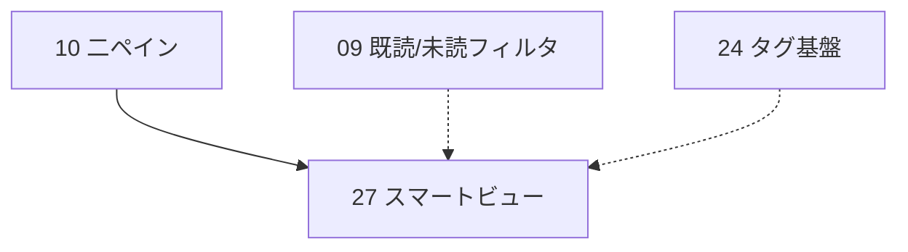

# 27 スマートビュー（保存検索の仮想フィード）

> 読み手前提: このリポジトリのコードは持っているが、この設計会話の文脈は知らない別セッションの実装者。本書 1 枚だけで着手・完了できるよう、再利用資産・SQL（完全文）・関数シグネチャ・ルート文字列・フロント差分・TDD ケース・番号付き手順まで具体化する。
> 裏取りした実ファイル（このセッションで実際に開いて確認した）: `backend/src/features/search/{domain,repository,service,handler,mod}.rs`、`backend/src/features/articles/{repository,handler,domain}.rs`、`backend/src/features/feeds/domain.rs`、`backend/src/features/folders/domain.rs`、`backend/src/features/mod.rs`、`backend/src/shared/{state,error}.rs`、`backend/migrations/`（最新 `0005_search.sql`）、`frontend/src/lib/{api.ts,store.tsx,selection.ts}`、`frontend/src/components/layout/SidebarContent.tsx`、`frontend/src/routes/{Reader,ArticleList}.tsx`、`frontend/src/index.tsx`。

---

## 1. 概要

ユーザーが組んだ**絞り込み条件（検索文字列・フィード・フォルダ・未読のみ・タグ）に名前を付けて保存**し、サイドバーに**仮想フィード（スマートビュー）**として常駐させる。クリックすると、その条件を毎回評価した結果の記事一覧が中央ペインに出る。実体カラム・実体テーブルは記事側に増やさず、**保存された条件 JSON を読み取り時に解決（resolve）**して記事を引く。「Rust 関連の未読だけ」「特定フォルダの "AI" を含む記事」といった視点を、毎回手で組み直さずに 1 クリックで開けるようにするのが狙い。

実装はバックエンドに新スライス **`saved_views`** を 1 枚追加する。責務は (1) ビューの CRUD（`saved_views` テーブル、`name` と条件 `query`(JSONB)）、(2) 保存条件の**解決**（条件 JSON → 記事一覧）。解決は新しい検索エンジンを作らず、**既存の `articles`/`search` スライスが使っている WHERE 述語パターンをそのまま 1 本の parametric クエリへ合成**して再利用する（`articles/repository.rs::list` の `$1::uuid IS NULL OR ...` 慣用、`search/domain.rs::SearchQuery::like_pattern` のエスケープ）。フロントは「仮想フィード」をサイドバーに描画し、選択中ビューを `/views/:viewId` のパス scope として `ArticleList` に解決させる（feed/folder scope の既存仕組みに 1 種類足すだけ）。

**タグ（#24）との連携**は条件の 1 項目 `tag_ids` として組み込むが、#24 が未マージの環境でも本機能のコア（テキスト/フィード/フォルダ/未読）は単独で成立するよう、タグ述語は #24 マージ後に足す 1 行に切り出す（§5.3 / §8）。

---

## 2. スコープ / 非スコープ

### スコープ（本機能で実装する）
- マイグレーション **`0006_saved_views.sql`**（番号は着手前に要確認。§4.1）。1 テーブル `saved_views`（`id`/`name`/`query` JSONB/`position`/`created_at`）。
- 新スライス `backend/src/features/saved_views/`（`domain` / `repository` / `service` / `handler` / `mod`）。
- ビュー CRUD:
  - `GET /api/saved-views`（一覧、`position` 昇順）
  - `POST /api/saved-views`（作成）
  - `GET /api/saved-views/{id}`（単体取得）
  - `PATCH /api/saved-views/{id}`（改名・条件変更・並び替え）
  - `DELETE /api/saved-views/{id}`（削除）
- ビュー解決: `GET /api/saved-views/{id}/articles?unread=<bool>` — 保存条件を読み取り時に評価して `Article[]` を返す。`unread` クエリで未読のみへ上書き可（サイドバーの「すべて/未読のみ」トグルと整合、`store.filter` 由来）。
- 条件 JSON の検証・正規化を**純粋関数**に切り出し単体テスト（`QuerySpec::validate`、`SavedViewName::parse`、`QuerySpec::is_empty`）。
- フロント: `lib/api.ts` に型 2・メソッド 6。`store.tsx` に `savedViews` リソース 1 本。`components/layout/SavedViewList.tsx`（サイドバーの仮想フィード一覧）と `routes/SavedViewEditor` 相当のダイアログ（`components/layout/SaveViewDialog.tsx`）。`lib/selection.ts` の `Scope` に `view` を 1 種追加し、`routes/ArticleList.tsx` に view scope の分岐を足す（feed/folder と同型の最小差分）。`frontend/src/index.tsx` に `/views/:viewId` ルートを 1 行追加。
- バックエンド自動テスト: ドメイン純粋関数（§9.1）+ リポジトリ/解決の HTTP スモーク（§9.2、psql 決定論シード + 実値 assert）。

### 非スコープ（本機能では実装しない）
- **ビューごとの未読数/件数バッジ**。一覧 `GET /api/saved-views` は条件を解決しない（各ビューを毎回 resolve すると重い）。サイドバーは名前のみ表示。件数表示は将来課題（§11。必要なら遅延 resolve か集計エンドポイント追加）。
- **AI による自然文→条件生成**（「Rust の未読を集めて」→ `QuerySpec`）。本書では**任意追加機能**として §5.8 に置き場所と流儀（`shared/llm` 再利用・`AppError::NotEnabled`・JSON パース純関数）だけ示し、**コアの完了条件には含めない**（effort を上げないため）。実装する場合は #24 の `parse_tag_suggestions` と同型で `parse_query_spec` を切り出すこと。
- **タグ述語の本実装**は #24（`article_tags` テーブル）に依存する。本書はコアを #24 非依存で完成させ、タグ述語は #24 マージ後に足す 1 行として明記する（§5.3 / §8）。
- **複数ユーザ / 共有ビュー**。単一ユーザ前提（ビューはグローバルに 1 セット、`owner` 列なし）。
- **記事の永続的な所属変更**。スマートビューは仮想であり、記事へ書き込みはしない（読み取り専用 read model）。
- **複雑なブール式**（OR グループ・NOT・ネスト）。条件は「各フィールドの AND」のフラット構造のみ（§4.2）。

---

## 3. 既存実装の調査と再利用

実ファイルを確認済み。以下を **再利用し、車輪の再発明をしない**。

| 再利用資産 | 実体（確認済みファイル） | 本機能での使い方 |
|---|---|---|
| 記事一覧の AND フィルタ慣用 | `articles/repository.rs::list`（`WHERE ($1::uuid IS NULL OR feed_id=$1) AND ($2=false OR is_read=false) AND ($3::uuid IS NULL OR feed_id IN (SELECT id FROM feeds WHERE folder_id=$3)) AND ($4=false OR feed_id IN (SELECT id FROM feeds WHERE folder_id IS NULL)) ORDER BY published_at DESC NULLS LAST, created_at DESC LIMIT 200`） | この述語群を `saved_views/repository.rs::resolve` に**そのまま合成**（feed/folder/unclassified/unread）。新エンジンは作らない |
| テキスト検索のエスケープ | `search/domain.rs::SearchQuery`（`parse`→trim/空拒否、`like_pattern`→`%…%` で LIKE メタ文字を `\` エスケープ、`ILIKE … ESCAPE '\'`） | 条件にテキストがあるとき `SearchQuery` を**import して**`like_pattern()` を流用（再実装しない。クロススライス domain 参照は `articles` が `FeedId`/`FolderId` を import する既存前例どおり） |
| 記事の型 | `articles/domain.rs::Article`（`#[derive(Serialize, sqlx::FromRow)]`、`SELECT *` で全列） | 解決結果はそのまま `Vec<Article>` を返す（フロントの `Article` 型と一致、`ArticleList`/`ArticleDetail` がそのまま描画） |
| 主キー newtype + 値オブジェクト | `feeds/domain.rs::{FeedId,FeedUrl::parse}`、`folders/domain.rs::FolderId`、`articles/domain.rs::ArticleId`（`#[sqlx(transparent)] pub struct X(pub Uuid)`、`parse()->Result<_,String>`） | `SavedViewId(pub Uuid)`・`SavedViewName::parse` を同型で新設。条件中の id は `Uuid` を素で持つ（読み取り read model なので newtype を跨いで持ち込まない。`feed_overview` の前例と同方針） |
| JSONB の読み書き | sqlx は `Cargo.toml` で `json` 有効。`sqlx::types::Json<T>` で構造体を JSONB 列に束縛できる（依存追加不要） | `saved_views.query` を `Json<QuerySpec>` で往復。`#[derive(Serialize,Deserialize)]` した `QuerySpec` をそのまま保存 |
| スライス構成 + `routes()` | `articles/mod.rs`・`search/mod.rs`・`folders/`（5 ファイル、`fn routes()->Router<AppState>`、パスパラメータは `{id}`、`get().post()`/`patch().delete()` チェーン） | 同じ 5 ファイル構成で `saved_views` を作る。パスは `/api/saved-views`・`/api/saved-views/{id}`・`/api/saved-views/{id}/articles` |
| `features/mod.rs` の合成 | `pub mod ...;` + `.merge(...::routes())`（現状 health/feeds/articles/stats/feed_overview/folders/instapaper/search の 8 枚） | `pub mod saved_views;` と `.merge(saved_views::routes())` を 1 行ずつ追加。既存スライスは触らない |
| upsert/削除/取得の sqlx 慣用 | `articles/repository.rs`（`fetch_optional().ok_or(AppError::NotFound)`、`rows_affected()`）、`instapaper/repository.rs`（`ON CONFLICT … DO UPDATE`） | 名前の大文字小文字無視ユニークは `ON CONFLICT` ではなく**事前 UNIQUE INDEX `lower(name)` + 違反を 400 に翻訳**（§5.7）。すべて `query`/`query_as`（`query!` 禁止） |
| `AppError` 6 バリアント | `shared/error.rs`（`NotFound`/404, `Validation`/400, `NotEnabled`/503, `Upstream`/502, `Database`/500, `Other`/500、`IntoResponse` で `Json({"error":<Display>})`） | 新バリアントを足さず既存で表現（§5.7）。`error.rs` は編集しない |
| `AppState{db,config,http}` | `shared/state.rs`（`#[derive(Clone)]`） | `state.db` を使う。AI 任意機能を入れる場合のみ `state.http`/`state.config`（§5.8） |
| フロント scope ルーティング | `lib/selection.ts`（`Scope` 直和 + `scopeFromPath` 純関数 + `useSelection`）、`routes/ArticleList.tsx`（scope→`listArticles` 引数組み立て）、`routes/Reader.tsx`（パス=scope, `?article` =選択） | `Scope` に `{kind:"view";viewId}` を 1 種追加し `scopeFromPath` に `/views/` 分岐を足す（純関数なので vitest 追加）。`ArticleList` の `params`/resource を view 時は `resolveSavedView` に分岐 |
| フロント API クライアント | `frontend/src/lib/api.ts`（`http<T>()` は 204→`undefined`、`errorStatus()`、`動詞+リソース` 命名） | `http<T>()` を再利用し型 2・メソッド 6 を追加 |
| 自前 UI 部品 + グローバル状態 | `components/ui/{button,input,dialog,badge}.tsx`、`lib/store.tsx`（`createContext` + `createResource` で `feeds`/`folders`）、`components/layout/SidebarContent.tsx`（`FeedTree`/`AddFeedDialog` を並べる）、`components/layout/AddFeedDialog.tsx`（ダイアログ前例） | `savedViews` リソースを `feeds`/`folders` と同型で追加。`SavedViewList`/`SaveViewDialog` を `FeedTree`/`AddFeedDialog` 同型で新設し `SidebarContent` に 1 行差し込む |
| HTTP スモークの慣習 | `scripts/test/api-stats.sh`/`api-feed-overview.sh`（稼働スタックに curl、psql 決定論シード + 実値 assert） | `scripts/test/api-saved-views.sh` を同型で新設（§9.2） |
| 自動マイグレーション実行 | `main.rs` → `db::run_migrations` → `sqlx::migrate!("./migrations")` | ファイルを置くだけで起動時適用。**番号順序に注意**（§4.1） |

> **依存追加は不要**: `uuid`/`serde`/`serde_json`/`sqlx`（`json`/`Json` 型）/`chrono` はすべて既存依存。`query`(JSONB) は `sqlx::types::Json<QuerySpec>` で読み書きでき、Cargo.toml の変更は不要。

---

## 4. データモデルとマイグレーション

### 4.1 マイグレーション番号の決め方（必読）

`main.rs` の `sqlx::migrate!("./migrations").run()` は `set_ignore_missing` を呼ばないため、**適用済み最大バージョンより小さい未適用マイグレーションを後から追加すると起動時に `VersionMissing`（out-of-order）でエラー**になる。

**ルール**: 着手前に `ls backend/migrations/` で最新番号を確認し、**最大番号 +1** を採る。本書執筆時点の最新は `0005_search.sql` なので、**暫定的に `0006_saved_views.sql`** と採番する。

> ⚠️ **`0006` の衝突注意**: #24（タグ基盤）も `0006_tags.sql` を暫定採番している。並行作業（#24・apalis 移行等）が先に `0006` を取った場合は `0007` 以降へ繰り上げること。既存マイグレーションは**編集しない**（追記のみ）。

### 4.2 スキーマ

新規ファイル **`backend/migrations/0006_saved_views.sql`**（番号は §4.1 で確認）:

```sql
-- 0006_saved_views.sql
-- Smart views: a saved set of article filter criteria, rendered as a virtual
-- feed in the sidebar. Single-user app, so views are global (no owner column).
-- The criteria live in `query` (JSONB) as a flat AND of optional fields
-- (see QuerySpec in saved_views/domain.rs). Resolution is read-only: the spec is
-- evaluated against `articles` at request time (no materialized membership).

CREATE TABLE IF NOT EXISTS saved_views (
    id         UUID PRIMARY KEY,
    name       TEXT NOT NULL,                  -- display name (as the user typed it)
    query      JSONB NOT NULL,                 -- QuerySpec: {text?, feed_id?, folder_id?,
                                               --   unclassified?, unread_only?, tag_ids?}
    position   INTEGER NOT NULL DEFAULT 0,     -- sidebar order (ascending)
    created_at TIMESTAMPTZ NOT NULL DEFAULT now()
);

-- Case-insensitive uniqueness on the name keeps the sidebar list unambiguous.
-- Violations are translated to 400 (AppError::Validation) in the repository.
CREATE UNIQUE INDEX IF NOT EXISTS idx_saved_views_name_lower ON saved_views (lower(name));

-- Sidebar ordering: position first, then creation time as a stable tie-break.
CREATE INDEX IF NOT EXISTS idx_saved_views_position ON saved_views (position, created_at);
```

設計判断:
- **`query` を JSONB にする理由**: 条件は将来項目が増えうる（例: 日付範囲・スター付きのみ #32）。列を増やさず JSONB に閉じることで、項目追加がマイグレーション不要になる。検証は構築時に Rust 側（`QuerySpec::validate`）で行うため、DB は構造を強制しない（柔軟性優先）。
- **解決を materialize しない理由**: スマートビューは「条件の保存」であって「記事集合の保存」ではない。新着記事が条件に合えば自動で含まれるべきなので、**読み取り時に毎回評価**する（`feed_overview` と同じ read model の発想）。
- **`lower(name)` ユニーク**: 仮想フィード名が一意になり、サイドバーで区別できる。`ON CONFLICT` で握り潰さず**違反を 400 に翻訳**する（ビュー作成は「同名が既にある」をユーザーに知らせたいため、tag のような暗黙再利用は不適切）。
- **`position`**: サイドバーの並び替え用。`PATCH` で更新。既定 0（作成順）。

`feeds`/`articles`/`folders` への列追加は**無い**。`articles` テーブルへの書き込みも無い（解決は SELECT のみ）。

---

## 5. バックエンド設計

新スライス **`backend/src/features/saved_views/`**。5 ファイル構成。書き込みは `saved_views` テーブルのみ、`articles`/`feeds` は**読み取り専用 SQL**で引く（`feed_overview`/`search` と同型の CQRS-lite 読み取り。禁止される「越境共通レイヤー」ではない）。新 trait / dyn は追加しない。

### 5.1 `domain.rs`（newtype + 値オブジェクト + 純粋ロジック）

```rust
use serde::{Deserialize, Serialize};
use uuid::Uuid;

use crate::shared::error::{AppError, AppResult};

#[derive(Debug, Clone, Copy, PartialEq, Eq, Serialize, sqlx::Type)]
#[sqlx(transparent)]
pub struct SavedViewId(pub Uuid);

/// 保存された絞り込み条件。各フィールドは任意（None = その軸で絞らない）。
/// 全フィールドの **AND** として解決する（OR/NOT/ネストは非スコープ §2）。
/// JSONB 列にこの構造をそのまま保存・復元する（sqlx::types::Json<QuerySpec>）。
#[derive(Debug, Clone, Default, PartialEq, Serialize, Deserialize)]
pub struct QuerySpec {
    /// タイトル/本文への部分一致（ILIKE）。trim 後に空なら無視。
    #[serde(default, skip_serializing_if = "Option::is_none")]
    pub text: Option<String>,
    /// 特定フィードに限定。
    #[serde(default, skip_serializing_if = "Option::is_none")]
    pub feed_id: Option<Uuid>,
    /// 特定フォルダ配下のフィードに限定。
    #[serde(default, skip_serializing_if = "Option::is_none")]
    pub folder_id: Option<Uuid>,
    /// フォルダ未割当のフィードに限定（folder_id と排他。両立時は §5.2 の SQL で AND）。
    #[serde(default)]
    pub unclassified: bool,
    /// 未読のみ。
    #[serde(default)]
    pub unread_only: bool,
    /// いずれかのタグが付いた記事に限定（#24 連携。空なら無視）。
    /// **#24 未マージの環境では空のままにすること**（§5.3 / §8）。
    #[serde(default)]
    pub tag_ids: Vec<Uuid>,
}

impl QuerySpec {
    /// 1 つも絞り込み軸が無い「全記事」条件か。空ビューの保存を弾くのに使う。
    pub fn is_empty(&self) -> bool {
        self.text.as_deref().map(str::trim).unwrap_or("").is_empty()
            && self.feed_id.is_none()
            && self.folder_id.is_none()
            && !self.unclassified
            && !self.unread_only
            && self.tag_ids.is_empty()
    }

    /// 構築時の検証・正規化。
    /// - 少なくとも 1 軸を要求（`is_empty` を拒否）。「全記事」は既存の「すべての記事」で足りる。
    /// - text は trim し、空文字なら None に畳む（`""` を保存しない）。
    /// - text 長すぎを弾く（暴走防止）。
    /// 戻り値は正規化済みの新しい QuerySpec。
    pub fn validate(mut self) -> AppResult<Self> {
        self.text = match self.text.take() {
            Some(t) => {
                let t = t.trim().to_string();
                if t.is_empty() {
                    None
                } else if t.chars().count() > MAX_TEXT_LEN {
                    return Err(AppError::Validation(format!(
                        "search text must be at most {MAX_TEXT_LEN} characters"
                    )));
                } else {
                    Some(t)
                }
            }
            None => None,
        };
        if self.is_empty() {
            return Err(AppError::Validation(
                "a smart view must have at least one filter".into(),
            ));
        }
        Ok(self)
    }
}

const MAX_TEXT_LEN: usize = 200;
const MAX_NAME_LEN: usize = 80;

/// 検証済みビュー名。空・長すぎを構築時に弾く。
#[derive(Debug, Clone, PartialEq, Eq)]
pub struct SavedViewName(String);

impl SavedViewName {
    pub fn parse(raw: impl Into<String>) -> Result<Self, String> {
        let n = raw.into().split_whitespace().collect::<Vec<_>>().join(" ");
        if n.is_empty() {
            return Err("view name must not be empty".into());
        }
        if n.chars().count() > MAX_NAME_LEN {
            return Err(format!("view name must be at most {MAX_NAME_LEN} characters"));
        }
        Ok(Self(n))
    }
    pub fn as_str(&self) -> &str {
        &self.0
    }
}

/// 永続化されたビュー。API レスポンスにそのまま使う。
/// query は QuerySpec をそのまま serde 出力（フロントの SavedView.query と一致）。
#[derive(Debug, Clone, Serialize)]
pub struct SavedView {
    pub id: SavedViewId,
    pub name: String,
    pub query: QuerySpec,
    pub position: i32,
    pub created_at: chrono::DateTime<chrono::Utc>,
}

/// DB 行（JSONB を Json<QuerySpec> で受ける中間型）。service で SavedView へ詰め替える。
#[derive(Debug, Clone, sqlx::FromRow)]
pub struct SavedViewRow {
    pub id: SavedViewId,
    pub name: String,
    pub query: sqlx::types::Json<QuerySpec>,
    pub position: i32,
    pub created_at: chrono::DateTime<chrono::Utc>,
}

impl From<SavedViewRow> for SavedView {
    fn from(r: SavedViewRow) -> Self {
        SavedView {
            id: r.id,
            name: r.name,
            query: r.query.0,
            position: r.position,
            created_at: r.created_at,
        }
    }
}

#[cfg(test)]
mod tests {
    use super::*;

    #[test]
    fn empty_spec_is_empty() {
        assert!(QuerySpec::default().is_empty());
    }

    #[test]
    fn text_only_is_not_empty() {
        let s = QuerySpec { text: Some("rust".into()), ..Default::default() };
        assert!(!s.is_empty());
    }

    #[test]
    fn whitespace_text_counts_as_empty() {
        let s = QuerySpec { text: Some("   ".into()), ..Default::default() };
        assert!(s.is_empty());
    }

    #[test]
    fn validate_rejects_all_empty() {
        assert!(QuerySpec::default().validate().is_err());
    }

    #[test]
    fn validate_trims_and_folds_blank_text_to_none() {
        let s = QuerySpec { text: Some("  rust async ".into()), ..Default::default() }
            .validate()
            .unwrap();
        assert_eq!(s.text.as_deref(), Some("rust async"));
    }

    #[test]
    fn validate_keeps_other_axes_when_text_blank() {
        let s = QuerySpec { text: Some("  ".into()), unread_only: true, ..Default::default() }
            .validate()
            .unwrap();
        assert_eq!(s.text, None);
        assert!(s.unread_only);
    }

    #[test]
    fn validate_rejects_overlong_text() {
        let long = "x".repeat(MAX_TEXT_LEN + 1);
        let s = QuerySpec { text: Some(long), ..Default::default() };
        assert!(s.validate().is_err());
    }

    #[test]
    fn name_parse_trims_and_collapses_whitespace() {
        let n = SavedViewName::parse("  Rust   未読 ").unwrap();
        assert_eq!(n.as_str(), "Rust 未読");
    }

    #[test]
    fn name_parse_rejects_empty() {
        assert!(SavedViewName::parse("   ").is_err());
    }
}
```

> 検証を純粋関数（`validate`/`is_empty`/`parse`）に切り出すのは、DB を立てずに TDD で Red→Green を回すため（MEMORY「書いたら必ず実行」「バグ修正もテスト先行」）。`""` 畳み込み・空ビュー拒否・長さ境界はここで完全にテストする（§9.1）。

### 5.2 `repository.rs`（`&PgPool` を取る free async fn、ランタイムクエリのみ）

```rust
use sqlx::PgPool;
use uuid::Uuid;

use super::domain::{QuerySpec, SavedView, SavedViewId, SavedViewRow};
use crate::features::articles::domain::Article;
use crate::features::search::domain::SearchQuery; // ← テキストのエスケープを再利用
use crate::shared::error::{AppError, AppResult};

const RESOLVE_LIMIT: i64 = 200; // articles::list と同じ上限

// ---- CRUD ----

pub async fn list(pool: &PgPool) -> AppResult<Vec<SavedView>> {
    let rows = sqlx::query_as::<_, SavedViewRow>(
        r#"SELECT id, name, query, position, created_at
           FROM saved_views
           ORDER BY position ASC, created_at ASC"#,
    )
    .fetch_all(pool)
    .await?;
    Ok(rows.into_iter().map(SavedView::from).collect())
}

pub async fn get(pool: &PgPool, id: SavedViewId) -> AppResult<SavedView> {
    let row = sqlx::query_as::<_, SavedViewRow>(
        r#"SELECT id, name, query, position, created_at
           FROM saved_views WHERE id = $1"#,
    )
    .bind(id.0)
    .fetch_optional(pool)
    .await?
    .ok_or(AppError::NotFound)?;
    Ok(row.into())
}

pub async fn insert(
    pool: &PgPool,
    name: &str,
    query: &QuerySpec,
    position: i32,
) -> AppResult<SavedView> {
    let row = sqlx::query_as::<_, SavedViewRow>(
        r#"INSERT INTO saved_views (id, name, query, position)
           VALUES ($1, $2, $3, $4)
           RETURNING id, name, query, position, created_at"#,
    )
    .bind(Uuid::new_v4())
    .bind(name)
    .bind(sqlx::types::Json(query)) // QuerySpec → JSONB
    .bind(position)
    .fetch_one(pool)
    .await
    .map_err(translate_unique_name)?;
    Ok(row.into())
}

pub async fn update(
    pool: &PgPool,
    id: SavedViewId,
    name: &str,
    query: &QuerySpec,
    position: i32,
) -> AppResult<SavedView> {
    let row = sqlx::query_as::<_, SavedViewRow>(
        r#"UPDATE saved_views
           SET name = $2, query = $3, position = $4
           WHERE id = $1
           RETURNING id, name, query, position, created_at"#,
    )
    .bind(id.0)
    .bind(name)
    .bind(sqlx::types::Json(query))
    .bind(position)
    .fetch_optional(pool)
    .await
    .map_err(translate_unique_name)?
    .ok_or(AppError::NotFound)?;
    Ok(row.into())
}

pub async fn delete(pool: &PgPool, id: SavedViewId) -> AppResult<u64> {
    let res = sqlx::query("DELETE FROM saved_views WHERE id = $1")
        .bind(id.0)
        .execute(pool)
        .await?;
    Ok(res.rows_affected())
}

/// lower(name) ユニーク制約違反を 400(Validation) に翻訳する。
/// それ以外の sqlx エラーはそのまま（? で Database/500 に乗る）。
fn translate_unique_name(e: sqlx::Error) -> AppError {
    if let sqlx::Error::Database(db) = &e {
        if db.constraint() == Some("idx_saved_views_name_lower") {
            return AppError::Validation("a view with this name already exists".into());
        }
    }
    AppError::Database(e)
}

// ---- 解決（読み取り時に条件 → 記事一覧）----

/// 保存条件を 1 本の parametric クエリへ合成して記事を引く。
/// articles::list の AND 述語慣用 + search の ILIKE エスケープを再利用する。
/// `unread_override = Some(true)` で未読のみへ上書き（None なら spec.unread_only に従う）。
pub async fn resolve(
    pool: &PgPool,
    spec: &QuerySpec,
    unread_override: Option<bool>,
) -> AppResult<Vec<Article>> {
    // text → ILIKE パターン（空/None なら NULL を渡して述語を無効化）。
    let like = match spec.text.as_deref() {
        Some(t) if !t.trim().is_empty() => Some(SearchQuery::parse(t)?.like_pattern()),
        _ => None,
    };
    let unread = unread_override.unwrap_or(spec.unread_only);

    let rows = sqlx::query_as::<_, Article>(
        r#"SELECT * FROM articles
           WHERE ($1::text IS NULL
                  OR title ILIKE $1 ESCAPE '\'
                  OR content ILIKE $1 ESCAPE '\')
             AND ($2::uuid IS NULL OR feed_id = $2)
             AND ($3::uuid IS NULL
                  OR feed_id IN (SELECT id FROM feeds WHERE folder_id = $3))
             AND ($4 = false
                  OR feed_id IN (SELECT id FROM feeds WHERE folder_id IS NULL))
             AND ($5 = false OR is_read = false)
           ORDER BY published_at DESC NULLS LAST, created_at DESC
           LIMIT $6"#,
    )
    .bind(like)                       // $1 Option<String> → NULL 可
    .bind(spec.feed_id)               // $2 Option<Uuid>
    .bind(spec.folder_id)             // $3 Option<Uuid>
    .bind(spec.unclassified)          // $4 bool
    .bind(unread)                     // $5 bool
    .bind(RESOLVE_LIMIT)              // $6 i64
    .fetch_all(pool)
    .await?;
    Ok(rows)
}
```

> **`articles` を読むことの正当化**: 解決には記事本文が要る。`instapaper/repository.rs::get_article_ref` や `feed_overview`/`search` が `articles` を読み取り専用で引く前例どおり許容。`articles` の**書き込み所有は移さない**。`query!` は使わず全て `query`/`query_as`。`bind(Option<T>)` は NULL にバインドされ、`$n::type IS NULL OR …` が述語を無効化する（articles::list と同じ仕組み）。

### 5.3 タグ述語（#24 連携・**後付けの 1 行**）

`tag_ids` を解決に効かせるには、§5.2 の `resolve` の WHERE に次の 1 行を足し、bind を 1 つ追加する。**`article_tags` テーブル（#24 / `0006_tags.sql` 系）が存在する環境でのみ**有効。#24 未マージ時はこの行を入れない（`tag_ids` は空運用、§8）。

```sql
             AND ($7::uuid[] IS NULL OR id IN (
                  SELECT article_id FROM article_tags WHERE tag_id = ANY($7)))
```

```rust
    // bind 追加（空 Vec は NULL 扱いにして述語を無効化）
    let tags: Option<Vec<Uuid>> =
        if spec.tag_ids.is_empty() { None } else { Some(spec.tag_ids.clone()) };
    // ... .bind(tags) // $7 Option<Vec<Uuid>>
```

> このように述語を 1 行に局所化しておくことで、#24 の有無で本スライスの実装方針が変わらない。コア（text/feed/folder/unclassified/unread）は #24 非依存で完結し、タグは「いずれかのタグを含む（OR）」のセマンティクスで後付けできる。

### 5.4 `service.rs`（`&AppState` を取り repository を統合）

```rust
use super::domain::{QuerySpec, SavedView, SavedViewId, SavedViewName};
use super::repository;
use crate::features::articles::domain::Article;
use crate::shared::error::{AppError, AppResult};
use crate::shared::state::AppState;

pub async fn list_views(state: &AppState) -> AppResult<Vec<SavedView>> {
    repository::list(&state.db).await
}

pub async fn get_view(state: &AppState, id: SavedViewId) -> AppResult<SavedView> {
    repository::get(&state.db, id).await
}

pub async fn create_view(
    state: &AppState,
    name: SavedViewName,
    query: QuerySpec,
    position: i32,
) -> AppResult<SavedView> {
    let query = query.validate()?; // 空条件・長すぎ text を弾く
    repository::insert(&state.db, name.as_str(), &query, position).await
}

pub async fn update_view(
    state: &AppState,
    id: SavedViewId,
    name: SavedViewName,
    query: QuerySpec,
    position: i32,
) -> AppResult<SavedView> {
    let query = query.validate()?;
    repository::update(&state.db, id, name.as_str(), &query, position).await
}

pub async fn delete_view(state: &AppState, id: SavedViewId) -> AppResult<()> {
    let n = repository::delete(&state.db, id).await?;
    if n == 0 {
        return Err(AppError::NotFound);
    }
    Ok(())
}

/// ビューを解決して記事一覧を返す。unread_override はクエリ ?unread= 由来。
pub async fn resolve_view(
    state: &AppState,
    id: SavedViewId,
    unread_override: Option<bool>,
) -> AppResult<Vec<Article>> {
    let view = repository::get(&state.db, id).await?; // 無ければ NotFound
    repository::resolve(&state.db, &view.query, unread_override).await
}
```

### 5.5 `handler.rs`（axum ハンドラ）

```rust
use axum::extract::{Path, Query, State};
use axum::http::StatusCode;
use axum::Json;
use serde::Deserialize;

use super::domain::{QuerySpec, SavedView, SavedViewId, SavedViewName};
use super::service;
use crate::features::articles::domain::Article;
use crate::shared::error::{AppError, AppResult};
use crate::shared::state::AppState;

pub async fn list_views(State(state): State<AppState>) -> AppResult<Json<Vec<SavedView>>> {
    Ok(Json(service::list_views(&state).await?))
}

pub async fn get_view(
    State(state): State<AppState>,
    Path(id): Path<uuid::Uuid>,
) -> AppResult<Json<SavedView>> {
    Ok(Json(service::get_view(&state, SavedViewId(id)).await?))
}

#[derive(Debug, Deserialize)]
pub struct UpsertBody {
    pub name: String,
    pub query: QuerySpec,
    #[serde(default)]
    pub position: i32,
}

pub async fn create_view(
    State(state): State<AppState>,
    Json(body): Json<UpsertBody>,
) -> AppResult<(StatusCode, Json<SavedView>)> {
    let name = SavedViewName::parse(body.name).map_err(AppError::Validation)?;
    let view = service::create_view(&state, name, body.query, body.position).await?;
    Ok((StatusCode::CREATED, Json(view)))
}

pub async fn update_view(
    State(state): State<AppState>,
    Path(id): Path<uuid::Uuid>,
    Json(body): Json<UpsertBody>,
) -> AppResult<Json<SavedView>> {
    let name = SavedViewName::parse(body.name).map_err(AppError::Validation)?;
    Ok(Json(
        service::update_view(&state, SavedViewId(id), name, body.query, body.position).await?,
    ))
}

pub async fn delete_view(
    State(state): State<AppState>,
    Path(id): Path<uuid::Uuid>,
) -> AppResult<StatusCode> {
    service::delete_view(&state, SavedViewId(id)).await?;
    Ok(StatusCode::NO_CONTENT)
}

#[derive(Debug, Deserialize)]
pub struct ResolveQuery {
    /// ?unread=true で未読のみへ上書き。省略時はビューの unread_only に従う。
    pub unread: Option<bool>,
}

pub async fn resolve_view(
    State(state): State<AppState>,
    Path(id): Path<uuid::Uuid>,
    Query(q): Query<ResolveQuery>,
) -> AppResult<Json<Vec<Article>>> {
    Ok(Json(
        service::resolve_view(&state, SavedViewId(id), q.unread).await?,
    ))
}
```

### 5.6 `mod.rs`（routes）

```rust
pub mod domain;
pub mod handler;
pub mod repository;
pub mod service;

use axum::routing::get;
use axum::Router;

use crate::shared::state::AppState;

pub fn routes() -> Router<AppState> {
    Router::new()
        .route(
            "/api/saved-views",
            get(handler::list_views).post(handler::create_view),
        )
        .route(
            "/api/saved-views/{id}",
            get(handler::get_view)
                .patch(handler::update_view)
                .delete(handler::delete_view),
        )
        .route(
            "/api/saved-views/{id}/articles",
            get(handler::resolve_view),
        )
}
```

> ルート文字列のパスパラメータは `{id}`（Axum 0.8 形式）。`/api/saved-views/{id}/articles` は静的セグメント `articles` を持つので `/api/saved-views/{id}` と衝突しない（matchit は静的を動的より優先）。

### 5.7 `features/mod.rs` への追加（2 行のみ）

```rust
pub mod saved_views; // 既存 pub mod 群（articles; feeds; folders; search; ...）に追加
// router() 内の .merge チェーンに追加（search の隣など）:
        .merge(saved_views::routes())
```

既存スライス（articles/feeds/folders/search/instapaper/feed_overview/health/stats）は一切触らない。

### 5.8 AppError の使い分け（`error.rs` は不編集）

| 状況 | バリアント | HTTP | レスポンス `error`（Display） |
|---|---|---|---|
| ビュー名が空 / 長すぎ | `Validation` | 400 | `invalid input: view name must not be empty` |
| 条件が空（全フィールド未指定） | `Validation` | 400 | `invalid input: a smart view must have at least one filter` |
| text が長すぎ / 解決時の `SearchQuery::parse` 失敗 | `Validation` | 400 | `invalid input: ...` |
| 同名ビューが既に存在（`lower(name)` 違反） | `Validation` | 400 | `invalid input: a view with this name already exists` |
| `GET`/`PATCH`/`DELETE`/`/articles` 対象ビューが無い | `NotFound` | 404 | `resource not found` |
| DB エラー | `Database`（`?` で自動 `From`） | 500 | `internal error` |

> 新バリアントは追加しない。解決（resolve）で `NotEnabled`/`Upstream` は発生しない（AI を入れない限り、§5.9）。

### 5.9 （任意・非スコープ）自然文 → 条件生成（AI）

> **これはコアの完了条件に含めない。** 実装する場合のみ、`shared/llm` を再利用し以下に従うこと（#24 のタグ提案と同型）:
> - エンドポイント `POST /api/saved-views/suggest-query`（body `{ "prompt": "Rust の未読を集めて" }`）。
> - `shared/llm/mod.rs` の `LlmClient` trait に `generate_query(&self, NlQueryRequest) -> AppResult<String>`（JSON 文字列を返す）を 1 メソッド追加し、`anthropic.rs` に `complete()` 再利用で実装（**唯一許された抽象境界への追記**。新 trait/dyn は作らない）。
> - `service` 側は #24 の `llm_client()` と同型で `anthropic_api_key` 未設定なら **`AppError::NotEnabled("ANTHROPIC_API_KEY is not set")`**（503）。
> - LLM の出力（JSON）を**純粋関数 `parse_query_spec(raw) -> Result<QuerySpec,String>`** に切り出してパース・検証（フェンス除去 → `serde_json` → `QuerySpec::validate`）。失敗は `AppError::Upstream`。`#24::parse_tag_suggestions` がそのまま雛形。
> - 生成結果はワンショットで、**DB キャッシュは不要**（ユーザーがそのまま保存すれば `saved_views` がキャッシュになる）。要約/翻訳のような重い再生成ではないため。

---

## 6. フロントエンド設計

### 6.1 `lib/api.ts` への追加（型 2 + メソッド 6）

型（backend JSON をミラー。`Article` は既存型を流用）:

```ts
export interface QuerySpec {
  text?: string;
  feed_id?: string;
  folder_id?: string;
  unclassified?: boolean;
  unread_only?: boolean;
  tag_ids?: string[]; // #24 連携（未マージ時は省略）
}

export interface SavedView {
  id: string;
  name: string;
  query: QuerySpec;
  position: number;
  created_at: string;
}
```

`api` オブジェクトにメソッド追加（既存 `http<T>()` を再利用、`動詞+リソース` 命名）:

```ts
  listSavedViews: () => http<SavedView[]>("/api/saved-views"),
  getSavedView: (id: string) => http<SavedView>(`/api/saved-views/${id}`),
  createSavedView: (body: { name: string; query: QuerySpec; position?: number }) =>
    http<SavedView>("/api/saved-views", {
      method: "POST",
      body: JSON.stringify(body),
    }),
  updateSavedView: (
    id: string,
    body: { name: string; query: QuerySpec; position?: number },
  ) =>
    http<SavedView>(`/api/saved-views/${id}`, {
      method: "PATCH",
      body: JSON.stringify(body),
    }),
  deleteSavedView: (id: string) =>
    http<void>(`/api/saved-views/${id}`, { method: "DELETE" }),
  // 仮想フィードの解決。unread でサイドバートグルの状態を渡す。
  resolveSavedView: (id: string, unread?: boolean) =>
    http<Article[]>(
      `/api/saved-views/${id}/articles${unread ? "?unread=true" : ""}`,
    ),
```

### 6.2 `store.tsx` への追加（仮想フィードのグローバル参照）

`feeds`/`folders` と同じ書き方で `savedViews` リソースを 1 本足す（サイドバーが描画に使う）:

```tsx
// UiStore に追加
  savedViews: Resource<SavedView[]>;
  refetchSavedViews(): void;
```

`AppProvider` 内:
```tsx
  const [savedViews, { refetch: refetchSavedViews }] = createResource(
    () => api.listSavedViews(),
    { initialValue: [] },
  );
```
`useApp()` の戻り値に `savedViews, refetchSavedViews: () => void refetchSavedViews()` を含める。`import { ..., type SavedView } from "@/lib/api"` を追加。

### 6.3 scope 拡張 `lib/selection.ts`（純関数 + vitest）

`Scope` に view を 1 種足し、`scopeFromPath` に `/views/` 分岐を入れる（feed/folder と同型）:

```ts
export type Scope =
  | { kind: "all" }
  | { kind: "feed"; feedId: string }
  | { kind: "folder"; folderId: string }
  | { kind: "view"; viewId: string }; // ← 追加（スマートビュー）

export function scopeFromPath(
  pathname: string,
  params: Record<string, string | undefined>,
): Scope {
  if (pathname.startsWith("/feeds/") && params.feedId)
    return { kind: "feed", feedId: params.feedId };
  if (pathname.startsWith("/folders/") && params.folderId)
    return { kind: "folder", folderId: params.folderId };
  if (pathname.startsWith("/views/") && params.viewId) // ← 追加
    return { kind: "view", viewId: params.viewId };
  return { kind: "all" };
}
```

### 6.4 `routes/ArticleList.tsx` の分岐（view scope のとき resolve を呼ぶ）

中央ペインは現在 `params()`（scope→listArticles 引数）から `createResource` で記事を引く。view scope のときだけ resolver を呼ぶよう、resource のフェッチャを分岐させる（最小差分）:

```tsx
// scope と filter の両方を依存にしたソースを作る
const source = () => ({ s: scope(), unread: app.state.filter === "unread" });

const [articles, { refetch }] = createResource(source, async ({ s, unread }) => {
  if (s.kind === "view") {
    return api.resolveSavedView(s.viewId, unread || undefined);
  }
  if (s.kind === "feed") return api.listArticles({ feed_id: s.feedId, unread: unread || undefined });
  if (s.kind === "folder")
    return s.folderId === "unclassified"
      ? api.listArticles({ unclassified: true, unread: unread || undefined })
      : api.listArticles({ folder_id: s.folderId, unread: unread || undefined });
  return api.listArticles({ unread: unread || undefined });
});
```

> 既存 `params()`/`createResource(params, …)` をこの `source`/分岐に置き換える。view 時は `markAll`（一括既読）を無効化/非表示にする（仮想フィードに「全部既読」は曖昧なため。`scope.kind === "view"` のとき「すべて既読」ボタンを `Show` で隠す）。

### 6.5 サイドバー描画 `components/layout/SavedViewList.tsx`（新規）

`FeedTree` と同型。`store.savedViews` を仮想フィードのリンク（`/views/:id`）として描画する。

```tsx
import { A } from "@solidjs/router";
import { For, Show } from "solid-js";
import { useApp } from "@/lib/store";

const item =
  "block h-8 px-2 rounded-md text-sm leading-8 hover:bg-accent truncate";
const active = "bg-accent text-accent-foreground";

/** サイドバーの「スマートビュー」セクション。保存条件を仮想フィードとして並べる。 */
export default function SavedViewList(props: { onNavigate?: () => void }) {
  const app = useApp();
  return (
    <Show when={(app.savedViews() ?? []).length > 0}>
      <div class="space-y-0.5">
        <p class="px-2 text-xs font-medium text-muted-foreground">スマートビュー</p>
        <For each={app.savedViews()}>
          {(v) => (
            <A
              href={`/views/${v.id}`}
              class={item}
              activeClass={active}
              onClick={() => props.onNavigate?.()}
              title={v.name}
            >
              {/* 仮想フィードであることを示す控えめなマーカー */}
              <span aria-hidden="true">⌕ </span>
              {v.name}
            </A>
          )}
        </For>
      </div>
    </Show>
  );
}
```

`components/layout/SidebarContent.tsx` に 1 行差し込む（`FeedTree` の上、`SearchBox`/`FilterToggle` の下あたり）:

```tsx
import SavedViewList from "./SavedViewList";
// ... JSX 内、<div class="flex-1 overflow-y-auto"> の直前か中に:
      <SavedViewList onNavigate={props.onNavigate} />
```

### 6.6 ビュー作成/編集ダイアログ `components/layout/SaveViewDialog.tsx`（新規）

`AddFeedDialog` と同型の Ark UI ダイアログ。フォーム項目: 名前（必須）/ テキスト / 未読のみ（switch）/ フィード（select、`app.feeds()`）/ フォルダ（select、`app.folders()`）。送信で `api.createSavedView`（または編集時 `updateSavedView`）→ `app.refetchSavedViews()` → `/views/:id` へ遷移。

```tsx
// 要点のみ（UI 詳細は AddFeedDialog を雛形に）
const submit = async () => {
  const query: QuerySpec = {
    text: text() || undefined,
    feed_id: feedId() || undefined,
    folder_id: folderId() || undefined,
    unread_only: unreadOnly() || undefined,
  };
  try {
    const v = await api.createSavedView({ name: name(), query });
    app.refetchSavedViews();
    navigate(`/views/${v.id}`);
    close();
  } catch (e) {
    // errorStatus(e) === 400 → 名前重複/空条件をフォームエラー表示
    setError(String(e));
  }
};
```

`SidebarContent` の `AddFeedDialog` の隣に `<SaveViewDialog />`（トリガは「ビューを保存」ボタン）を置く。**「検索結果からビュー化」**の導線（`routes/Search.tsx` の検索語を初期 `text` にして本ダイアログを開く）は任意の上乗せ（§11）。

### 6.7 ルート登録 `frontend/src/index.tsx`（1 行）

既存 `path={["/", "/feeds/:feedId", "/folders/:folderId"]}`（component=`Reader`）に view を足す:

```tsx
<Route
  path={["/", "/feeds/:feedId", "/folders/:folderId", "/views/:viewId"]}
  component={Reader}
/>
```

`Reader`/`ArticleList` は scope を `useSelection` で読むため、ルートを足すだけで view scope が中央ペインに流れる（§6.4 の分岐が解決を呼ぶ）。

---

## 7. API 契約

すべて JSON。`Content-Type: application/json`。エラーは `{"error": "<message>"}`（`AppError::IntoResponse`）。

### 7.1 `GET /api/saved-views`
- リクエスト: なし。
- レスポンス `200 OK`: `SavedView[]`（`position ASC, created_at ASC`）。

```json
[
  {
    "id": "7b1c0d2e-2a3b-4c5d-8e9f-0a1b2c3d4e5f",
    "name": "Rust 未読",
    "query": { "text": "rust", "unread_only": true },
    "position": 0,
    "created_at": "2026-06-30T09:00:00Z"
  }
]
```

### 7.2 `POST /api/saved-views`
- リクエスト:
```json
{ "name": "AI フォルダ", "query": { "folder_id": "aaaaaaaa-...-aaaa", "text": "AI" }, "position": 1 }
```
- レスポンス `201 Created`: 作成された `SavedView`。
- エラー: `400`（名前空/重複、条件空、text 長すぎ）。

### 7.3 `GET /api/saved-views/{id}`
- レスポンス `200 OK`: `SavedView`。`404` if not found。

### 7.4 `PATCH /api/saved-views/{id}`
- リクエスト: POST と同形（`name`/`query`/`position` 全置換）。
- レスポンス `200 OK`: 更新後 `SavedView`。`404`/`400`。

### 7.5 `DELETE /api/saved-views/{id}`
- レスポンス `204 No Content`。`404` if not found。

### 7.6 `GET /api/saved-views/{id}/articles?unread=<bool>`
- クエリ: `unread`（任意。`true` で未読のみへ上書き。省略時はビューの `unread_only`）。
- レスポンス `200 OK`: `Article[]`（`published_at DESC NULLS LAST, created_at DESC`、最大 200）。記事 0 件は空配列。
- エラー: `404`（ビュー無し）、`400`（保存 text が `SearchQuery::parse` を通らない＝理論上起きないが防御的に）。

```json
[
  { "id": "…", "feed_id": "…", "url": "https://…", "title": "Rust 1.99 released",
    "content": "…", "published_at": "2026-06-29T22:14:00Z", "is_read": false,
    "summary": null, "summary_lang": null, "translation": null,
    "translation_lang": null, "processed_at": null, "created_at": "2026-06-29T22:20:00Z" }
]
```

---

## 8. 依存関係

- **このチケットが必要とするもの（ハード）**:
  - **#10 二ペインレイアウト**（`store.tsx`/`selection.ts`/`Reader.tsx`/`ArticleList.tsx`/`SidebarContent.tsx`）。本機能はこのシェルへ scope 1 種と仮想フィード描画を足す形なので、二ペインが先に着地している必要がある（本書執筆時点で main にマージ済み = 充足）。
  - **`search` スライス**（`SearchQuery::like_pattern` を解決で import 再利用）と **`articles` スライス**（`Article` 型・list 述語慣用）。いずれも main にマージ済み = 充足。新規依存パッケージは無し。
- **このチケットが必要とするもの（ソフト）**:
  - **#24 タグ基盤**（`article_tags` テーブル）。`query.tag_ids` による絞り込みは #24 マージ後に §5.3 の 1 行を足して有効化する。**#24 未マージでもコア（text/feed/folder/unclassified/unread）は単独で完成**するため、本機能は #24 を待たずに着手・出荷できる（`tag_ids` を空運用にするだけ）。
- **このチケットがブロックする / 土台になるもの**:
  - 将来の **ダイジェスト**（保存ビュー単位の定期まとめ）・**通知**（ビューに新着があったら知らせる）の土台になりうる。本書では非スコープ。
- **触れるが結合を作らない**: `articles`/`search`/`feeds` テーブルは読み取り専用 SQL で引くのみ（CQRS-lite）。それらスライスのコードは編集しない。

依存グラフ（実線=ハード, 点線=ソフト）:



---

## 9. テスト計画（TDD）

**Red → 理解 → Green の順。書いたら必ず実行する。**

> テスト配置の前提（実慣習）: 本 crate はバイナリ専用（library target 無し）で `backend/tests/` も無いため、内部 fn を呼ぶ結合テストは書けない。純粋ロジックは `#[cfg(test)] mod tests`、HTTP 経由の検証は `scripts/test/*.sh`（psql 決定論シード + 実値 assert）で行う（`api-feed-overview.sh` の前例どおり）。

### 9.1 単体テスト（`#[cfg(test)] mod tests`、§5.1 に同梱・DB 不要）

`backend/src/features/saved_views/domain.rs` に**先に**書く（Red）。

| テスト | 意図 |
|--------|------|
| `empty_spec_is_empty` | 全フィールド未指定 = 空（保存不可の境界） |
| `text_only_is_not_empty` | text だけでも有効条件 |
| `whitespace_text_counts_as_empty` | 空白のみ text は空扱い（`""` ビュー防止） |
| `validate_rejects_all_empty` | 空条件を 400 へ（`Validation`） |
| `validate_trims_and_folds_blank_text_to_none` | text の trim と `""`→None 畳み込み |
| `validate_keeps_other_axes_when_text_blank` | text 空でも他軸があれば有効 |
| `validate_rejects_overlong_text` | text 長さ境界（暴走防止） |
| `name_parse_trims_and_collapses_whitespace` | 名前の正規化（内部空白畳み） |
| `name_parse_rejects_empty` | 空名拒否 |

実行: `cd backend && cargo test saved_views`（DB 不要）。`just lint`（clippy `-D warnings` + tsc）も通す。

### 9.2 HTTP スモーク（`scripts/test/api-saved-views.sh`、新規・**実値 assert**）

`api-feed-overview.sh` を雛形に、psql でフィード/フォルダ/記事を決定論シードし、(1) CRUD の往復、(2) 解決の**実値**を assert する。内部 DB へは `docker compose exec -T db psql` で到達（DB はホスト非公開）。

シード例:
- フィード F（`…aa`）、フォルダ G（`…cc`）に属する。記事:
  - r1: title `Rust async`, `is_read=false`, `published_at = now()-'1 day'`
  - r2: title `Go routines`, `is_read=true`, `published_at = now()-'2 days'`
  - r3: title `rust macros`, content に `rust`, `is_read=false`

検証フロー:
1. `POST /api/saved-views` `{name:"Rust未読", query:{text:"rust", unread_only:true}}` → `201`、`id` を控える。
2. `GET /api/saved-views` → 配列にそのビューが居る（名前一致）。
3. `GET /api/saved-views/{id}/articles` → r1 と r3 を含み r2 を含まない（`text=rust` AND 未読）。`map(.title) | contains` で assert。
4. `GET /api/saved-views/{id}/articles?unread=false` → 上書きで未読条件を外しても、ビューの `text` は効く（r2 "Go" は依然含まれない、`rust` を含む既読があれば含まれる）。
5. **重複名**: 同名で `POST` → `400`（`error` に "already exists"）。
6. **空条件**: `{name:"X", query:{}}` → `400`。
7. `DELETE /api/saved-views/{id}` → `204`。再 `GET {id}` → `404`。
8. 後始末: シードした feed/folder/記事を `DELETE`（CASCADE で記事も消える）。

assert は `jq -e` の述語内で行い、bool/配列包含を検証。**Red**: 実装前は `/api/saved-views` が 404 → スクリプトが落ちる。実装後 Green。

### 9.3 フロント（手動 / 型）
- `tsc`（`just lint` の `pnpm typecheck`）で `SavedView`/`QuerySpec` 型・`resolveSavedView()`・`Scope` の view 追加・`ArticleList` 分岐の整合を確認。
- `lib/selection.ts` の `scopeFromPath` に vitest を 1 ケース追加（`/views/abc` → `{kind:"view", viewId:"abc"}`）。既存の selection テストファイルに追記。
- 手動: ダイアログでビュー作成 → サイドバーに仮想フィードが出る → クリックで `/views/:id` に遷移し中央ペインが条件解決の記事を表示 → 「すべて/未読のみ」トグルが解決にも効く（`?unread`）→ 削除でサイドバーから消える、を目視。

---

## 10. 実装手順（順序付きチェックリスト）

1. ブランチを切る（例 `feat/smart-views`）。`main` 直コミットしない。
2. `ls backend/migrations/` で最新番号を確認し `backend/migrations/0006_saved_views.sql` を作成（§4.2。#24/apalis が 0006 を取っていたら +1 へ繰り上げ）。
3. `backend/src/features/saved_views/` に 5 ファイルを置く:
   - `domain.rs`（§5.1。**まず `#[cfg(test)] mod tests` を書いて Red**、`QuerySpec`/`SavedViewName`/`SavedView`/`SavedViewRow`）。
   - `repository.rs`（§5.2。CRUD + `resolve` + `translate_unique_name`）。
   - `service.rs`（§5.4）。
   - `handler.rs`（§5.5）。
   - `mod.rs`（§5.6、`routes()`）。
4. `cd backend && cargo test saved_views` で単体テストを Green に。
5. `backend/src/features/mod.rs` に `pub mod saved_views;` と `.merge(saved_views::routes())` を 1 行ずつ追加（§5.7）。他スライスは触らない。
6. `cargo build` → `just lint`（clippy `-D warnings` + tsc）→ `cargo fmt`。
7. スタック起動（`just up` または `just dev-db` + `just back`）。
8. `scripts/test/api-saved-views.sh` を追加（§9.2）、実行 → CRUD/解決/重複/空条件/削除を Green で確認。
9. フロント:
   - `lib/api.ts`: 型 `QuerySpec`/`SavedView` + メソッド 6（§6.1）。
   - `lib/store.tsx`: `savedViews` リソース + `refetchSavedViews`（§6.2）。
   - `lib/selection.ts`: `Scope` に view 追加 + `scopeFromPath` 分岐（§6.3）+ vitest 1 ケース。
   - `routes/ArticleList.tsx`: resource を `source` 分岐へ置換、view 時は `resolveSavedView`、`markAll` を view で非表示（§6.4）。
   - `components/layout/SavedViewList.tsx` 新設、`SidebarContent.tsx` に 1 行差し込み（§6.5）。
   - `components/layout/SaveViewDialog.tsx` 新設、`SidebarContent` に配置（§6.6。`AddFeedDialog` を雛形）。
   - `frontend/src/index.tsx`: ルート配列に `/views/:viewId` を追加（§6.7）。
10. `just lint`（tsc + vitest）を通し、§9.3 の手動シナリオを目視確認。
11. （#24 が既にマージ済みなら）§5.3 のタグ述語 1 行 + bind を `resolve` に足し、`SaveViewDialog` にタグ選択を追加。未マージなら `tag_ids` 空運用のまま見送り。
12. ユーザーが望むタイミングでコミット（メッセージ末尾に `Co-Authored-By` 行）。新規マイグレーション番号が衝突していないか最終確認。

---

## 11. リスク・未決事項・代替案

| 項目 | リスク | 対処 |
|------|------|------|
| **マイグレーション番号衝突** | #24(`0006_tags`)・apalis(`0006_apalis`) と `0006` が競合 | 着手直前に `ls backend/migrations/` で最新番号を確認し +1 へ繰り上げ。既存ファイルは不編集 |
| **#24 への依存度** | `tag_ids` を本実装に組み込むと #24 未マージで `article_tags` 不在によりビルド/実行が壊れる | タグ述語を §5.3 の後付け 1 行に隔離。コアは #24 非依存で完成（`tag_ids` 空運用）。#24 マージ後に有効化 |
| **解決クエリの性能** | text(ILIKE) + フォルダのサブクエリは記事増で全件 scan になりうる（trigram index は `similarity` 用で複合述語には効きにくい） | 家庭内・単一ユーザ規模では当面問題なし。`LIMIT 200` で上限。重くなれば `pg_trgm` の GIN index 活用や materialized 化を新マイグレーションで（読み取りスライス内に閉じる） |
| **`unclassified` と `folder_id` の同時指定** | 両方真だと「フォルダ X 配下 かつ 未割当」= 常に 0 件 | `QuerySpec::validate` で両立を弾くのも可だが、SQL 上は AND で自然に 0 件になる無害なケース。MVP は弾かず、UI（`SaveViewDialog`）で排他選択にして防ぐ |
| **ビュー一覧に件数バッジが無い** | 「未読 N 件」が出ず仮想フィードの魅力が半減 | 非スコープ（§2）。各ビューの resolve は重いので一覧で一括解決しない。将来、軽量な `COUNT` 専用エンドポイント or 遅延 resolve を追加（`feed_overview` 同型の集計案） |
| **AI 自然文生成の置き場所** | 入れる場合に `shared/llm` 以外へ抽象を散らす誘惑 | §5.9 の方針に厳密に従う（trait に 1 メソッド・`NotEnabled`・`parse_query_spec` 純関数・キャッシュ不要）。本書コアには含めない |
| **PATCH の全置換セマンティクス** | 部分更新を期待した呼び出しで意図せぬ上書き | API 契約（§7.4）で「name/query/position 全置換」を明記。フロントは編集ダイアログで既存値をプリフィルしてから送る |
| **「検索結果からビュー化」導線** | Search 画面の語をビューにする UX が無いと作成導線が弱い | 任意の上乗せ。`routes/Search.tsx` の検索語を `SaveViewDialog` の初期 `text` に渡すだけ（本書の API/型で対応可能）。MVP はサイドバーの「ビューを保存」ボタンで足りる |
| **scope 追加の回帰** | `ArticleList` の resource 置換が feed/folder/all の既存挙動を壊す | §6.4 の分岐は既存 4 ケースを温存しつつ view を 1 つ足すだけ。`scopeFromPath` は純関数なので vitest で全 kind を回帰確認（§9.3） |
