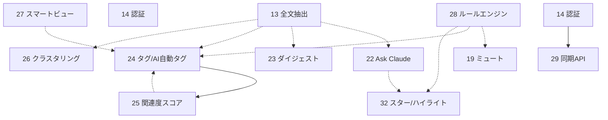

# 34. 整合性メモ（第2弾・採番順・依存・実装順）

> 第2弾（13–33）の各設計書を突き合わせた横断整合メモ。**最大の論点は「全機能が暫定で `0006_*.sql` を主張しており、マイグレーション番号が衝突する」こと。** 本書で依存順に沿った推奨採番を確定する。横断方針は [12-roadmap-foundation.md](./12-roadmap-foundation.md)。

## 1. マイグレーション番号レジスタ（推奨採番）

執筆時点の最新は **`0005_search.sql`**。下表は**推奨ターゲット番号**であり、実番号は **着手・マージ時に `backend/migrations/` の最大値+1** を採る（追記のみ・既存不編集）。並行作業時は **先にマージした側が番号を取得し、他方は繰り上げる**。

| 推奨# | 機能 | 追加/変更 | 種別 |
|------|------|-----------|------|
| 0006 | 13 全文抽出 | `ALTER articles ADD full_content, extracted_at` | 既存列追加 |
| 0007 | 15 バックアップ | `backup_runs`（実行履歴。任意。export/import 自体は無くても可） | 新規 |
| — | 14 認証 | **MVP は単一トークン＝マイグレーション無し**（`auth_sessions` は将来のセッション化時のみ） | なし |
| 0008 | 16 Read-on-Save | `read_later_settings` | 新規 |
| 0009 | 19 ミュート | `mute_rules` ＋ `ALTER articles ADD muted_at`（+部分index） | 新規＋列 |
| 0010 | 21 フィード健全性 | `ALTER feeds ADD last_fetch_status, last_error, consecutive_failures` | 既存列追加 |
| — | 17 OPML / 18 キーボード / 20 自動検出 | **マイグレーション無し** | なし |
| 0011 | 22 Ask Claude | `article_notes`（Q&A保存。任意保存分） | 新規 |
| 0012 | 23 ダイジェスト | `digests` | 新規 |
| 0013 | 24 タグ＋AI自動タグ | `tags`, `article_tags`, `article_tag_suggestions` | 新規 |
| 0014 | 25 関連度スコアリング | `article_relevance_scores`（**24 依存**） | 新規 |
| 0015 | 26 クラスタリング | `article_clusters`, `cluster_members` | 新規 |
| 0016 | 27 スマートビュー | `saved_views` | 新規 |
| 0017 | 28 ルールエンジン | `automation_rules`（＋`ALTER articles ADD rules_applied_at`, 任意 `author`） | 新規＋列 |
| 0018 | 32 スター/ハイライト（スタブ） | `article_stars`, `highlights` | 新規 |
| 0019 | 29 同期API（スタブ） | `sync_starred`（＋任意 `sync_tokens`、14で代替可） | 新規 |
| 0020 | 30 ニュースレター（スタブ） | `newsletter_sources`, `newsletter_messages` | 新規 |
| 0021 | 31 PWAプッシュ（スタブ） | `push_subscriptions` ＋ `ALTER feeds ADD priority` | 新規＋列 |
| 0022 | 33 TTS（スタブ・v2のみ） | `ALTER articles ADD listen_script, listen_script_lang`（任意） | 既存列追加 |

> **⚠️ apalis 移行との衝突**: 並行中の apalis 移行も新マイグレーション（ジョブテーブル）を取る。**0006 を先取りする可能性が高い**。着手直前に必ず最新番号を確認し、本表は相対順序として読むこと（番号そのものは前後しうる）。

## 2. 依存グラフ（第2弾内のハード/ソフト依存）

実線=ハード（先に必要）、点線=ソフト（無くても動くが推奨）。第1弾(01–11)・`shared/llm`・`shared/scheduler`・`0005 search(pg_trgm)` は既存前提。

- **唯一の第2弾内ハード依存**: `25 → 24`（関連度はタグ語彙を使う）、`29 → 14`（同期APIは認証必須）。
- **`tags`(24) が事実上の中核前提**（ソフト）: 23/25/27/28 がタグを活用。AI 群では 24 を早めに。
- **`full_content`(13) が AI 入力の質を底上げ**（ソフト）: 22/23/24/26 は 13 後が望ましいが、無くても `content` で成立。
- 第1弾へのソフト依存: 16→{05,06,09}、15→{02,06}、21→{01,03}、17→{01,02}、18/27→10、20→01。すべて実装済みなので問題なし。

## 3. 推奨実装順（フェーズ）

各フェーズ内は並行着手可。早期に価値を出しつつ依存を満たす順。

- **フェーズ0 — 基盤**: **13 全文抽出**（最優先＝全AIの天井を上げる）/ **14 認証**（公開前の安全弁）/ **15 バックアップ**。
- **フェーズ1 — クイックウィン（並行）**: 16 Read-on-Save（最小）/ 17 OPML / 18 キーボード / 19 ミュート / 20 自動検出 / 21 健全性。DB変更が無い 17/18/20 は最速。
- **フェーズ2 — AI 差別化**: **22 Ask**（最安・旗艦）→ **24 タグ**（土台）→ 23 ダイジェスト → **25 関連度**（24後）→ 26 クラスタリング。
- **フェーズ3 — 整理・自動化**: 27 スマートビュー（24後が理想）→ 28 ルールエンジン（19/24 を内包）。
- **将来（スタブ詳細化後）**: 32 スター/ハイライト（小・Askの素地）→ 29 同期API（14後）→ 30 ニュースレター → 31 プッシュ → 33 TTS。

## 4. 整合性チェック結果

- **エンドポイント衝突: なし。** 全機能のパスは独立（`/api/articles/{id}/...` 配下も `extract`/`ask`/`notes`/`tags`/`suggest-tags` で非衝突）。
- **マイグレーション番号衝突: あり → 本書 §1 で解消。** 各設計書の「0006」は暫定。実装時は §1 の相対順 + 最新番号確認で確定。
- **`articles` への列追加が複数機能で発生**（13/19/25?/28/33）: いずれも additive な `ALTER ADD COLUMN` で相互非干渉。別マイグレーションに分けて衝突回避（同一機能の列は同一マイグレーションへ）。
- **19/24 と 28 の重複**: ミュート(19)・タグ自動付与(24) はルールエンジン(28)の部分集合。**単機能で先行出荷 → 28 で条件/アクションへ移送し専用テーブル/UI を将来廃止**（28 設計の「共存期」注記に従う。共存しても破壊的ではない）。
- **命名ゆれ**: Ask(22) のスライス名は `article_query` か `articles` 拡張かが揺れている。**`articles` 既存スライスに `ask`/`notes` ハンドラを足す**（`article_notes` テーブルのみ新規）方針で統一推奨（新スライスを増やしすぎない）。
- **認証の前提**: 14 マージ後、第2弾の全エンドポイントは横断ミドルウェア配下（個別認証コード不要）。同期API(29)のみトークン別経路。
- **AI キャッシュ列命名**: 既存 `summary`/`summary_lang`/`processed_at` の `<feature>`/`<feature>_lang`/`<feature>_at` 規約に全AI機能を揃える（[12](./12-roadmap-foundation.md) §4-3）。

---

*生成: 2026-06-30 / 第2弾設計の整合レビュー（session limit で未生成だった分をメタ情報から補complete）。*
