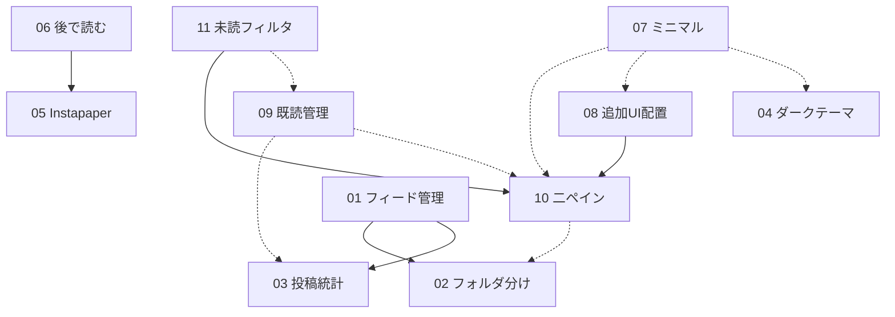

# 機能追加 設計書インデックス

RSS リーダーへ追加する **11 機能** の設計書一式。別セッションの実装者が、この `docs/design/` 配下のドキュメントだけで着手できることを目的に書かれている。

- 起票元: 2026-06-26 の別セッションでユーザーが挙げた機能要望（`CLAUDE.md` の「ユーザー要望の機能バックログ」と対応）。
- 各設計書は **概要 / スコープ / 既存実装の再利用 / データモデル / バックエンド / フロントエンド / API 契約 / 依存関係 / テスト計画(TDD) / 実装手順 / リスク** の順で記述。
- まず横断方針の **土台設計2枚を必ず読むこと**。各機能設計はこの土台に従っている。

## 読む順序

1. [00-foundation-backend.md](./00-foundation-backend.md) — バックエンド横断（マイグレーション割り当て・新スライス境界・データモデル・共通規約）
2. [00-foundation-frontend.md](./00-foundation-frontend.md) — フロントエンド横断（二ペインシェル・グローバル状態・ルーティング・Ark UI 部品・デザイン指針）
3. 各機能設計（下表）

## アーキテクチャ準拠の前提（全機能共通）

- **Vertical Slice**: 新機能 = 新スライス1枚（`domain/repository/service/handler/mod`）＋ `features/mod.rs` に `.merge()` 一行。既存スライス拡張は「同一アグリゲートへの書き込み」に限り正当化。
- **sqlx は runtime クエリのみ**（`query!` コンパイル時マクロ禁止）。
- **マイグレーションは追記のみ**（既存 `0001_init.sql` は不編集、新規 `000N_*.sql` を追加）。
- **trait を増やさない**（差し替え予定のない境界に `dyn` を足さない。抽象境界は `shared/llm` のみ）。
- **既存資産を再利用**（`articles.is_read` ＋ 未読部分インデックス、`repository::list` の unread フィルタ、`mark_read`、`.dark` 配線済み、`AppError::NotEnabled` パターン）。
- **単一ユーザ前提**（テーマ等のクライアント状態は DB に持たない）。

## 機能一覧

| # | 機能 | 規模 | DB/API 変更 | 主な依存 | 設計書 |
|---|------|:----:|:-----------:|----------|--------|
| 01 | フィード管理機能 | L | あり | 02, 03 | [01-feed-management.md](./01-feed-management.md) |
| 02 | フィードのフォルダ分け | L | あり (0002) | — | [02-feed-folders.md](./02-feed-folders.md) |
| 03 | 最終投稿経過日数・投稿頻度の表示 | M | あり (集計のみ) | — | [03-feed-stats.md](./03-feed-stats.md) |
| 04 | ダークテーマ切り替え | M | なし | — | [04-dark-theme.md](./04-dark-theme.md) |
| 05 | Instapaper 連携 | M | あり (0003) | — | [05-instapaper-integration.md](./05-instapaper-integration.md) |
| 06 | 「後で読む」機能 | M | あり (0004) | 05 | [06-read-later.md](./06-read-later.md) |
| 07 | ミニマルデザイン・視認性向上 | M | なし | 10,08,04 (整合) | [07-minimal-design.md](./07-minimal-design.md) |
| 08 | フィード追加 UI の配置見直し | S | なし | 10 | [08-feed-add-placement.md](./08-feed-add-placement.md) |
| 09 | 既読管理 | M | あり (集計のみ) | 03,10 (ソフト) | [09-read-management.md](./09-read-management.md) |
| 10 | 二ペインのリーダーレイアウト | XL | なし | 02 (ソフト) | [10-two-pane-layout.md](./10-two-pane-layout.md) |
| 11 | 「すべて/未読のみ」切り替え | S | なし | 10 | [11-unread-filter-toggle.md](./11-unread-filter-toggle.md) |

> 「DB/API 変更=なし」の5機能（04・07・08・10・11）は**フロント作業＋既存 API 再利用のみ**。バックエンドのコードは一切変更しない。

## 依存関係グラフ

実線＝ハード依存（先に必要）、点線＝ソフト依存／整合（無くても動くが推奨）。

**ルート（依存なしで単独着手可）**: 02・03・04・05・10・09(核)。
**リーフ（多くに依存）**: 07・11。

## 推奨実装順

依存を満たしつつ、早期に価値を出せる順。各フェーズ内は並行着手可。

### フェーズ1 — バックエンド土台（データ & read model）
- **03 投稿統計** … 読み取り専用スライス `feed_overview`（`GET /api/feeds/overview`）を新設。フィード別 未読数/総数/最終投稿/投稿頻度を1クエリで返す。01・09 の土台。
- **02 フォルダ分け** … `0002` マイグレーション（`folders` ＋ `feeds.folder_id`）＋ `folders` スライス。
- **09 既読管理（核）** … `POST /api/articles/read-all`（一括既読）＋ `ArticleView` 自動既読。03/10 無しでも動く独立部分から。

*理由*: 01 と二ペイン左ペインのバッジ表示が、03/02 の存在を前提にする。DB 変更を最初にまとめて確定させ、以降のフロント作業の地盤を固める。

### フェーズ2 — フィード管理
- **01 フィード管理** … `/manage` ルート。`PATCH /api/feeds/{id}`（改名・フォルダ割当）。**02・03 のマージ後に着手**。

### フェーズ3 — レイアウト刷新
- **10 二ペイン** … `App.tsx` を二ペイン化し、グローバルストア（`store.tsx`）と `useSelection` を導入。以降のフロント機能の置き場所を作る最重要土台。
- **04 ダークテーマ** … 独立・小規模。ストアの `theme` フィールドだけなので 10 と同時並行で入れると衝突が少ない。

*理由*: 10 は単独出荷可能（フラットなフィードナビで動く）だが、08・11・01 の UI 置き場所を提供するため早めに通す。

### フェーズ4 — レイアウト派生
- **08 追加UI配置** … 記事一覧上部の追加 input を撤去し `AddFeedDialog` へ。**10 必須**。
- **11 未読フィルタ** … 「すべて/未読」トグルをストアの `filter` に。**10 必須**（09 はソフト）。

### フェーズ5 — デザイン仕上げ
- **07 ミニマルデザイン** … 全画面の restyle 指針＋共有プリミティブ（`badge.tsx` 等）。10/08/04 の確定後に整合させると手戻りが少ない。

### フェーズ6 — Instapaper 系
- **05 Instapaper 連携** … `0003` マイグレーション＋ `instapaper` スライス。`/settings` で資格情報設定。
- **06 後で読む** … `0004` マイグレーション。**05 必須**（同一 `instapaper` スライスに同居）。

## マイグレーション番号レジスタ（⚠️ 衝突注意）

設計が確定的に使う新規マイグレーション:

| 番号 | ファイル | 機能 |
|------|----------|------|
| 0002 | `0002_folders.sql` | 02 フォルダ分け |
| 0003 | `0003_instapaper.sql` | 05 Instapaper |
| 0004 | `0004_read_later.sql` | 06 後で読む |

> **⚠️ apalis 移行タスクとの番号衝突**: 並行して進めている **apalis 移行**（`apalis` ジョブテーブル）も `0002_apalis.sql` を追加予定。**0002 は先に着手・マージした側が取得**し、他方は番号を繰り下げること（マイグレーションは追記のみ・既存不編集が鉄則のため、番号の付け替えはマージ前に行う）。着手前に必ず `backend/migrations/` の最新番号を確認する。

## リスク・要確認レジスタ

| 項目 | 内容 | 対処 |
|------|------|------|
| **マイグレーション番号** | apalis 移行と 0002 が衝突しうる（上記） | 着手直前に最新番号を確認し繰り下げ |
| **Ark UI v5 の API** | `switch`/`select`/`dropdown-menu`/`tree-view`/`tooltip` の part 名・props はメジャーで変わる | 実装時に [ark-ui.com](https://ark-ui.com)（Solid）で要確認。各設計書に明記済み |
| **Instapaper Simple API** | `/api/add`・`/api/authenticate` の正確な仕様・重複時挙動 | [instapaper.com/api](https://www.instapaper.com/api) で要確認。05 設計書に検証フォールバック記載 |
| **二ペイン移行の影響範囲** | 10 は `App.tsx`・ルーティング・`FeedList.tsx→ArticleList.tsx` 改名を伴い、08/11/04/09 と同一ファイルを同居編集 | 10 を先に通し、派生機能はその上に追記。`store.tsx`/`Sidebar.tsx`/`ArticleList.tsx` のマージ衝突に注意 |
| **`feed_overview` の命名ゆれ** | バックエンド土台は `feed_overview`/`GET /api/feeds/overview`、フロント土台は `feed_stats`/`GET /api/feeds/stats` と表記が割れている | 03 実装時にどちらかへ統一。**フィールド名 `unread_count` と突合キー `feed_id` は 09 が固定契約として要求**（別名にしないこと） |
| **lucide-solid 新規依存** | 07 がアイコン用に導入提案 | 採否は要決定。不採用なら inline SVG フォールバック |
| **集計クエリの性能** | 03 の投稿頻度は全件集計で `idx_articles_published_at` が効かない | 家庭内小規模では問題なし。記事数増大時は materialized 列へ昇格（将来・新マイグレーション） |

---

# 第2弾（2026-06-30 ロードマップ）

第1弾（00–11）は実装・main マージ済み。第2弾は、外部 RSS リーダー（商用/OSS/ネイティブ）調査を基にした**機能拡張ロードマップ**の設計書一式（13–33）。本アプリの核心的優位＝**既に Claude API を呼べること**を軸に、AI 差別化・基盤・クイックウィン・整理自動化を揃える。第1弾同様、**この `docs/design/` 配下だけで別（低 effort）セッションが着手できる**ことを目的に書かれている。

## 読む順序（第2弾）

1. [12-roadmap-foundation.md](./12-roadmap-foundation.md) — 第2弾の横断土台（スライス境界・マイグレーション規約・認証ミドルウェア・AI共通パターン・依存・テスト）。**00 系の土台を継承**するので先に 00 も読むこと。
2. [34-integration-notes.md](./34-integration-notes.md) — ★**マイグレーション番号レジスタ・依存グラフ・推奨実装順**。着手前に必ず参照（全機能が暫定 0006 を主張＝衝突するため本書で採番を確定）。
3. 各機能設計（下表）

## 機能一覧（第2弾）

「規模」S<M<L<XL。「DB」=新マイグレーション要否。詳細採番は 34 参照。

| # | 機能 | フェーズ | 規模 | DB | 主な依存 | 設計書 |
|---|------|:------:|:----:|:--:|----------|--------|
| 13 | 記事全文抽出 (readability) ★AI土台 | 0 基盤 | M | 要 | articles/llm | [13](./13-full-content-extraction.md) |
| 14 | 認証 / アクセス制御 | 0 基盤 | M | MVP不要 | — | [14](./14-auth-access-control.md) |
| 15 | バックアップ / 復元 | 0 基盤 | L | 任意 | 02,06 | [15](./15-backup-restore.md) |
| 16 | Read-on-Save | 1 クイック | S | 要 | 05,06,09 | [16](./16-read-on-save.md) |
| 17 | OPML 入出力 | 1 クイック | M | 不要 | 01,02 | [17](./17-opml-import-export.md) |
| 18 | キーボード操作 | 1 クイック | S | 不要(FE) | 10 | [18](./18-keyboard-navigation.md) |
| 19 | ミュート (NGワード) | 1 クイック | M | 要 | →28 | [19](./19-mute-filters.md) |
| 20 | フィード自動検出 | 1 クイック | M | 不要 | 01 | [20](./20-feed-autodiscovery.md) |
| 21 | フィード健全性 | 1 クイック | M | 要 | 01,03 | [21](./21-feed-health.md) |
| 22 | Ask Claude (対話Q&A) ★旗艦 | 2 AI | M | 要 | llm,articles | [22](./22-ask-claude.md) |
| 23 | AI デイリーダイジェスト | 2 AI | M | 要 | llm,scheduler | [23](./23-ai-daily-digest.md) |
| 24 | タグ＋AI自動タグ ★前提 | 2 AI | M | 要 | articles,llm | [24](./24-tags-and-auto-tagging.md) |
| 25 | AI 関連度スコアリング | 2 AI | M | 要 | **24** | [25](./25-ai-relevance-scoring.md) |
| 26 | 意味的クラスタリング | 2 AI | L | 要 | 0005,llm,scheduler | [26](./26-semantic-clustering.md) |
| 27 | スマートビュー (保存検索) | 3 整理 | M | 要 | 10,search,(24) | [27](./27-smart-views.md) |
| 28 | カスタムルールエンジン | 3 整理 | L | 要 | (19,24,32) | [28](./28-rules-engine.md) |
| 29 | Google Reader 同期API | 将来 | L〜XL | 要 | **14** | [29](./29-sync-api.md) |
| 30 | ニュースレター→RSS | 将来(stub) | M〜L | 要 | 01,02,05,06 | [30](./30-newsletter-to-rss.md) |
| 31 | PWA プッシュ通知 | 将来(stub) | L | 要 | — | [31](./31-pwa-push.md) |
| 32 | スター＋ハイライト | 将来(stub) | S〜L | 要 | — | [32](./32-stars-highlights.md) |
| 33 | 読み上げ (TTS) | 将来(stub) | S〜M | v2のみ | — | [33](./33-tts-listen-mode.md) |

> **除外**: 没入フルスクリーン読書（既存3ペイン＋単記事ビュー＋prose＋4テーマと重複のため設計せず）。
> **30–33 はスタブ**（約1ページ）。着手前に各設計を本格詳細化すること。29 は完全版に詳細化済み（2026-07-07。GReader 互換に一本化し、Fever API はスコープから削除 — 経緯は [29](./29-sync-api.md) 冒頭参照）。

## 推奨実装順（第2弾・詳細は [34](./34-integration-notes.md)）

フェーズ0 基盤（13→14→15）→ フェーズ1 クイックウィン（16/17/18/19/20/21 並行）→ フェーズ2 AI（22→24→23→25→26）→ フェーズ3 整理自動化（27→28）→ 将来（32→29→30→31→33）。

> **第2弾内ハード依存**: `25→24`・`29→14` のみ（14 は実装済み — Cookie セッション認証、migration 0022 — のため 29 の依存は充足済み）。`24 タグ` は 23/25/27/28 の事実上の前提（早めに）。`13 全文抽出` は全 AI の品質上限を上げる土台（最優先）。

---

*生成: 第1弾 2026-06-26 / 第2弾 2026-06-30。いずれも多エージェント設計ワークフロー（グラウンド/土台 → 機能設計 → 整合・敵対的レビュー）。第2弾は外部RSSリーダー調査（110機能）→現状突合→採点→設計の順で作成。各設計書は `docs/design/` 単体で実装着手できる粒度。*
